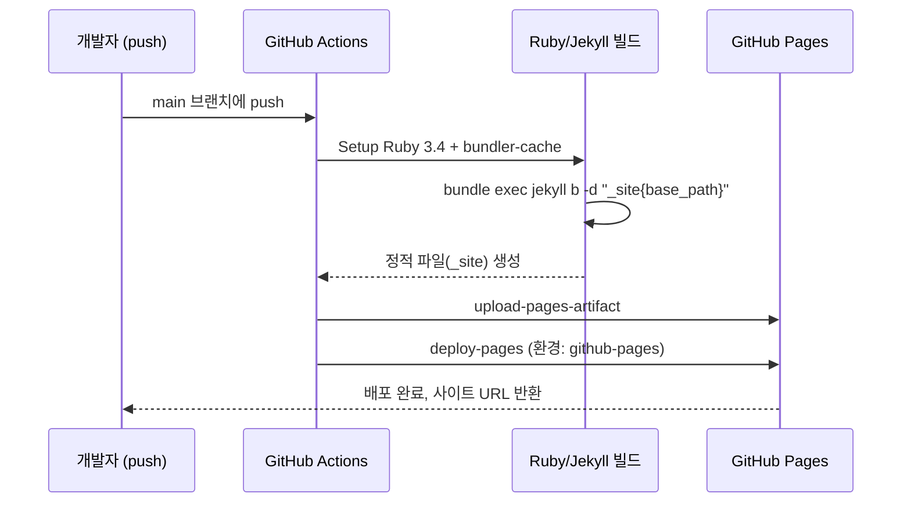

## 들어가며 (Situation)

학습 기록을 남길 개인 블로그를 만들면서, 단순히 글만 올리는 게 아니라 **정적 사이트 빌드 → 배포까지의 파이프라인 전체를 직접 구성**해보고 싶었다. Jekyll(Chirpy 테마) 기반으로 블로그를 만들고 GitHub Actions로 GitHub Pages에 자동 배포하는 구조를 잡는 과정에서, 초기 스캐폴딩 이후 폴더 구조와 설정 파일을 몇 차례 고쳐야 했다.

## 문제 상황 (Task)

처음 블로그 기본틀을 커밋했을 때(`블로그 기본틀`), 레포 루트에 `_config.yml`, `Gemfile`, `pages-deploy.yml`, `about.md`, 예시 포스트 파일이 한 번에 놓여 있었다. 이 상태로는 두 가지 문제가 있었다.

1. **GitHub Actions 워크플로 파일이 인식되지 않음**: GitHub Actions는 `.github/workflows/` 경로에 있는 YAML만 워크플로로 인식한다. 루트에 있던 `pages-deploy.yml`은 그냥 텍스트 파일일 뿐, 실제로 실행되는 CI/CD 파이프라인이 아니었다.
2. **Jekyll 컬렉션 규칙이 지켜지지 않음**: Jekyll은 글을 `_posts/`, 커스텀 탭 페이지를 `_tabs/`(Chirpy 테마 컬렉션) 아래에 두어야 인식한다. 루트에 있던 `about.md`와 예시 포스트는 사이트 빌드 시 정적 페이지/글로 잡히지 않는 상태였다.
3. **개인 식별 정보 미반영**: `_config.yml`의 `url`, `github.username`, `baseurl`이 전부 플레이스홀더(`<GITHUB_USERNAME>`, `/my-blog`)로 남아 있어, 실제로 배포해도 사이트 링크와 자산 경로가 깨지는 상태였다.

## 해결 과정 (Action)

### 1) 문제를 원인별로 분리해서 커밋하기

한 번에 다 고치기보다, 원인을 나눠서 순서대로 처리했다.

| 순서 | 커밋 | 해결한 문제 |
|------|------|-------------|
| 1 | `블로그 기본틀` | Jekyll 사이트 스캐폴딩 최초 생성 (`_config.yml`, `Gemfile`, `pages-deploy.yml` 등) |
| 2 | `수정` | 스캐폴딩 중 중복 생성된 가이드 파일 제거 |
| 3 | `다시 커밋 수정` | `pages-deploy.yml` 내용 오류 수정 |
| 4 | `폴더 구조 변경` | 워크플로/포스트/탭 파일을 Jekyll·GitHub Actions 컨벤션 경로로 이동 |
| 5 | `내 정보 들어가도록 한 버전` | `_config.yml`의 `url`, `github.username`, `baseurl`을 실제 값으로 교체 |

### 2) 폴더 구조를 컨벤션에 맞게 이동

핵심은 "Jekyll과 GitHub Actions가 무엇을 어디서 찾는가"였다.

```bash
pages-deploy.yml → .github/workflows/pages-deploy.yml
about.md         → _tabs/about.md
2026-08-28-example-post.md → _posts/2026-08-28-example-post.md
```

경로만 바꿨을 뿐인데도 이 이동이 실제로 의미를 가지는 이유는, GitHub Actions와 Jekyll 둘 다 **파일 내용이 아니라 파일 위치를 기준으로 동작을 트리거**하기 때문이다. 내용이 문법적으로 완벽해도 정해진 디렉토리에 있지 않으면 그냥 무시된다는 점이 인상 깊었다.

### 3) 실제 배포 파이프라인 이해하기

`.github/workflows/pages-deploy.yml`을 옮기고 나서 실제로 어떤 흐름으로 빌드·배포가 되는지 뜯어봤다.



여기서 `permissions: { contents: read, pages: write, id-token: write }` 부분이 특히 눈에 띄었다. `id-token: write`는 OIDC(OpenID Connect) 기반으로, GitHub Actions가 별도의 배포 비밀번호나 토큰을 저장소에 저장하지 않고도 GitHub Pages에 배포 권한을 위임받는 방식이다. 비밀 값을 저장하지 않고 필요한 순간에만 권한을 받는 구조라는 점이 흥미로웠다.

### 4) `_config.yml`에 실제 값 반영

```yaml
url: "https://hhy0123.github.io"
github:
  username: hhy0123
baseurl: "/hyblog"
```

`baseurl`은 프로젝트 페이지(`username.github.io/레포명`)로 운영할 때 실제 저장소 이름과 반드시 일치해야 한다. 이 값이 틀리면 HTML 자체는 정상 빌드돼도 CSS·이미지 등 정적 자산 경로가 전부 어긋나서, 배포는 "성공"했는데 사이트는 깨져 보이는 상태가 된다. 겉으로는 성공한 것처럼 보이는 배포가 실제로는 실패인 경우가 있다는 걸 확인한 부분이다.

## 결과 (Result)

| 항목 | Before | After |
|------|--------|-------|
| GitHub Actions 워크플로 인식 | 인식 안 됨 (루트에 위치) | `.github/workflows/`로 인식 정상화 |
| 포스트/탭 페이지 빌드 반영 | 반영 안 됨 (루트에 위치) | `_posts/`, `_tabs/`로 이동 후 정상 반영 |
| `_config.yml` 개인 정보 | 플레이스홀더 3개(`url`, `username`, `baseurl`) | 전부 실제 값으로 교체 |
| 커밋 수 | - | 원인별로 분리한 5개 커밋 |

정량적인 성능 지표는 아니지만, "빌드가 아예 안 되던 상태 → 정상적으로 CI/CD 파이프라인을 타고 배포되는 상태"로 바뀐 것 자체가 이번 작업의 결과다. 특히 원인을 하나씩 분리해서 커밋한 덕분에, 나중에 문제가 재발했을 때 `git log`만 보고도 어느 단계에서 무엇이 바뀌었는지 바로 추적할 수 있게 됐다.

## 더 학습하면 좋은 개념

- **CI/CD 파이프라인 설계** — 빌드-업로드-배포 단계를 분리하고 트리거 조건을 정의하는 방식은 어떤 종류의 애플리케이션을 배포하든 동일하게 적용되는 원리다.
- **GitHub Actions의 OIDC 기반 권한 위임** — `id-token: write`로 장기 저장 토큰 없이 권한을 위임받는 방식을 이해하면, 클라우드(AWS IAM Role, GCP Workload Identity 등)의 임시 자격 증명 개념으로 자연스럽게 확장할 수 있다.
- **정적 파일 서빙과 자산 경로(baseurl) 문제** — 사이트를 서빙할 때 베이스 경로가 어떻게 자산 경로 계산에 영향을 주는지 이해하면, 다른 배포 환경(서브패스 배포, CDN 등)에서도 같은 원리를 적용할 수 있다.
- **설정 파일 컨벤션(Convention over Configuration)** — 여러 도구가 "정해진 위치의 파일을 자동으로 읽는" 방식을 쓴다. 왜 이런 설계를 택하는지, 트레이드오프는 무엇인지 알아두면 다른 도구를 익힐 때도 빠르게 적응할 수 있다.
- **의존성 잠금(Bundler/Gemfile.lock)** — `bundler-cache: true`로 캐싱되는 의존성 관리 방식을 이해하면, 재현 가능한 빌드(reproducible build)를 만드는 방법을 익히는 데 도움이 된다.

## 참고 자료

- [GitHub Pages 공식 문서](https://docs.github.com/en/pages)
- [GitHub Actions - 워크플로 문법](https://docs.github.com/en/actions/writing-workflows/workflow-syntax-for-github-actions)
- [GitHub Actions - OpenID Connect를 사용한 클라우드 인증 정보 보안 강화](https://docs.github.com/en/actions/security-for-github-actions/security-hardening-your-deployments/about-security-hardening-with-openid-connect)
- [Jekyll 공식 문서 - Directory Structure](https://jekyllrb.com/docs/structure/)
- [Chirpy 테마 문서](https://github.com/cotes2020/jekyll-theme-chirpy)
