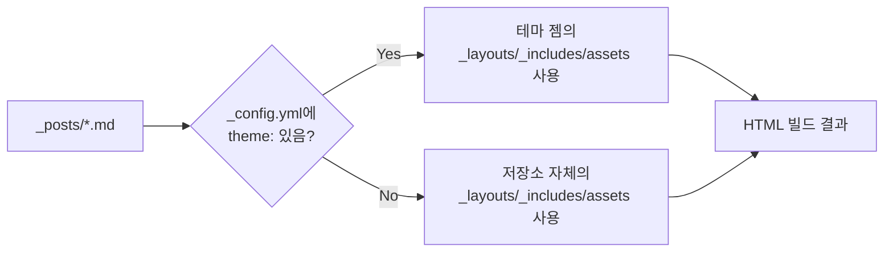

## 들어가며 (Situation)

지난 글([Jekyll 블로그가 GitHub Pages에서 빌드되지 않던 문제 해결기]({{ '/posts/jekyll-github-pages-deploy-setup/' | relative_url }}))에서 GitHub Actions 빌드 자체는 정상화했다. 하지만 그건 어디까지나 "배포가 되느냐"의 문제였고, 실제로 사이트를 열어보니 Chirpy 테마의 기본 다크 색상이 밋밋하게 느껴졌다. 처음엔 색만 살짝 바꾸면 될 줄 알았는데, 결국 테마 젬 자체를 걷어내고 레이아웃을 직접 만드는 데까지 이어졌다.

## 문제 상황 (Task)

1. **1차 요구**: 검정 바탕에 파랑·보라를 섞은 색으로 바꾸고 싶다.
2. **2차 요구**: 색만 바꾸는 걸로는 부족하다. Chirpy 테마 자체를 없애고 레이아웃 형식을 새로 만들고 싶다.
3. 테마를 걷어내려니 확신이 안 서는 지점이 있었다 — *Jekyll이 테마 젬 없이도 정상 동작하는가?* 이 질문에 답을 못 하면 테마 제거 자체가 리스크였다.
4. 테마를 없애면 지금까지 Chirpy가 대신 해주던 것들(글 목록, 목차, 태그/카테고리 표시, 코드 하이라이트, 사이드바 내비게이션)을 전부 직접 구현해야 했다.

## 해결 과정 (Action)

### 1) 첫 시도: 테마는 유지하고 색만 오버라이드

Jekyll 공식 문서에는 테마 젬과 같은 경로에 파일을 두면 **사이트 쪽 파일이 우선 적용된다**는 규칙이 있다.

> "Jekyll will look first to your site's content before looking to the theme's defaults for any requested file in the following folders: `/assets`, `/_data`, `/_layouts`, `/_includes`, `/_sass`"

이 규칙을 이용해서 `assets/css/jekyll-theme-chirpy.scss`를 사이트 저장소에 만들고, Chirpy가 쓰는 CSS 커스텀 프로퍼티(`--main-bg`, `--link-color` 등)만 검정+파랑+보라 값으로 오버라이드했다. 테마 골격은 그대로 두고 색만 바꾸는, 가장 리스크가 적은 방법이었다.

### 2) 요구가 바뀜: 테마 자체를 걷어내기

색만 바꾼 결과물도 나쁘지 않았지만, 원했던 건 "다른 사람이 만든 틀 위에 색만 입힌 것"이 아니라 "형식 자체를 직접 만든 것"이었다. 그래서 Chirpy 젬 의존을 완전히 제거하기로 했다.

먼저 확인한 건 Jekyll에서 `theme:` 설정이 필수가 아니라는 점이었다. `_config.yml`에 `theme: jekyll-theme-chirpy`처럼 테마를 지정하면 그 젬 안의 `_layouts`/`_includes`/`_sass`/`assets`를 가져다 쓰지만, 이 줄을 아예 빼면 Jekyll은 그냥 저장소 안의 `_layouts`, `_includes`, `assets`만 보고 빌드한다. Jekyll의 핵심 역할(마크다운+Liquid → HTML 변환)은 테마 유무와 무관하게 동일하다.



이 확신을 바탕으로 다음을 진행했다.

| 항목 | Before (Chirpy) | After (자체 제작) |
|------|------------------|--------------------|
| `Gemfile` | `jekyll-theme-chirpy` 젬 | `jekyll` 젬 직접 명시 |
| 레이아웃 | 테마 젬 내부 `_layouts` | `_layouts/default·home·post·page.html` 직접 작성 |
| 스타일 | 테마 SCSS + 변수 오버라이드 | `assets/css/style.css` 전부 직접 작성 |
| 목차(TOC) | 테마 내장 JS | `assets/js/main.js`에서 `##`/`###` 제목을 스캔해 생성 |
| 소개 페이지 | `_tabs/about.md` (Chirpy 컬렉션 규칙) | 루트 `about.md` + `permalink: /about/` |

### 3) 시행착오: 첫 배포가 실패했다

구조를 다 바꾸고 푸시했더니 GitHub Actions 빌드가 실패했다. 로컬에 Ruby가 없어서 직접 빌드해볼 수 없었기 때문에, GitHub REST API로 실행 상태와 실패한 스텝을 확인했다.

```bash
curl -s "https://api.github.com/repos/hhy0123/hyblog/actions/runs?per_page=1" \
  | grep -E '"status"|"conclusion"'
```

원인은 단순했다. `_config.yml`에 `plugins: [jekyll-paginate]`라고 적어놓고, 정작 `Gemfile`에는 그 젬을 추가하지 않았던 것이다. Jekyll이 플러그인을 `require`하려다 못 찾아서 빌드 자체가 죽는, 아주 흔한 실패 패턴이었다. 글이 아직 2개뿐이라 페이지네이션이 꼭 필요한 상황도 아니어서, 젬을 추가하는 대신 `paginator.posts` 대신 `site.posts` 전체를 순회하는 방식으로 바꿔 의존성 자체를 없앴다.

### 4) 디자인 보강

기본 틀이 빌드된 뒤에는 "양옆이 허전하다"는 피드백에 맞춰 다듬었다.

- 홈 화면 상단에 아바타 + 소개 문구가 있는 히어로 섹션 추가
- 본문 오른쪽에 "소개/카테고리/태그" 사이드바 추가 — 카테고리·태그는 `site.categories`, `site.tags`를 순회해서 **글의 front matter만 보고 자동 생성**되도록 함
- 개별 포스팅 오른쪽에는 목차를 sticky 사이드바로 배치
- 배경에 옅은 파랑·보라 radial gradient를 깔고, 글 목록은 그라데이션 포인트가 있는 카드형으로 변경

## 결과 (Result)

| 항목 | Before | After |
|------|--------|-------|
| 외부 테마 젬 의존 | 있음 (`jekyll-theme-chirpy`) | 없음 (`jekyll` 코어만 사용) |
| 배포 시도 | - | 1회 실패 → 원인(플러그인 미설치) 파악 후 성공 |
| 색상 커스터마이징 자유도 | 테마가 제공하는 CSS 변수 범위 내 | 레이아웃·CSS·JS 전부 직접 제어 |
| 카테고리/태그 목록 | 수동 관리 없음(테마 기능) | `site.categories`/`site.tags` 기반 자동 생성 유지 |

가장 크게 배운 건 "테마"가 Jekyll의 필수 구성 요소가 아니라 **레이아웃을 미리 만들어 배포해둔 젬일 뿐**이라는 점이다. 그 관계를 정확히 알고 나니, 테마를 걷어내는 게 "Jekyll을 안 쓰는 것"이 아니라 "Jekyll은 그대로 두고 남이 만든 레이아웃 대신 내가 만든 레이아웃을 쓰는 것"이라는 게 명확해졌다.

## 더 학습하면 좋은 개념

- **Jekyll 테마의 파일 오버라이드 우선순위** — `/assets`, `/_layouts`, `/_includes`, `/_sass`, `/_data`에서 사이트 파일이 테마보다 우선한다는 규칙을 알면, 테마를 완전히 걷어내지 않고도 부분적으로 커스터마이징하는 절충안을 선택할 수 있다.
- **Liquid 템플릿 언어** — 반복문·조건문 같은 제어 구문과 `site.categories`/`site.tags` 같은 전역 변수를 다루는 문법. 레이아웃을 직접 짜려면 필수로 알아야 하는 부분.
- **CSS Grid를 이용한 반응형 레이아웃** — 본문+사이드바 2단 구성을 그리드로 짜고 좁은 화면에서 1단으로 접는 패턴은 블로그 외에도 대부분의 대시보드/문서 UI에서 반복되는 구조다.
- **GitHub Actions 빌드 로그 읽는 법** — 이번엔 REST API로 상태만 확인했지만, `gh run view --log` 등으로 실패한 스텝의 상세 로그를 직접 보는 방법을 익히면 원인 추적이 훨씬 빨라진다.
- **정적 사이트의 자동 분류(collection) 메커니즘** — `site.categories`/`site.tags`처럼 정적 사이트 생성기가 콘텐츠 메타데이터를 스캔해서 목록을 자동으로 만들어주는 방식은, 이후 검색·필터링 기능을 붙일 때도 같은 원리로 확장된다.

## 참고 자료

- [Jekyll 공식 문서 - Themes (파일 오버라이드 규칙)](https://jekyllrb.com/docs/themes/)
- [Jekyll 공식 문서 - Pagination](https://jekyllrb.com/docs/pagination/)
- [Jekyll 공식 문서 - Front Matter Defaults](https://jekyllrb.com/docs/configuration/front-matter-defaults/)
- [Liquid 공식 문서](https://shopify.github.io/liquid/)
- [Mermaid 공식 문서](https://mermaid.js.org/)
