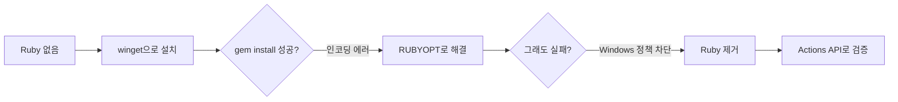

## 들어가며 (Situation)

지난 글([빌드 문제는 해결했지만 밋밋했던 디자인을 직접 테마를 만들어 바꾼 과정]({{ '/posts/jekyll-theme-from-scratch/' | relative_url }}))에서 만든 자체 제작 테마로 블로그를 운영하면서, 홈 화면 히어로 영역(검색창이 있는 상단 배너)을 다듬는 작업을 하고 있었다. 검색창이 고정 너비(260px)로 배치돼 있다 보니 그 옆으로 빈 공간이 꽤 남았는데, 이 공간을 장식이 아니라 실제로 쓸모 있는 기능으로 채우고 싶었다.

## 문제 상황 (Task)

조건이 세 가지였다.

1. 이미 있는 사이드바(소개·카테고리·태그)나 본문 리스트와 **절대 겹치지 않을 것**
2. 기술 블로그에 어울리는, 장식이 아닌 **실사용 가능한 기능**일 것
3. Jekyll/Liquid 템플릿과 JS를 여러 파일에 걸쳐 고치는 작업이라, **머지 전에 실제로 빌드가 되는지 확인**할 것

세 번째 조건이 이번 글의 진짜 주제가 됐다. 확인하려고 보니 이 PC에서는 로컬 Jekyll 빌드 자체가 막혀 있었기 때문이다.

## 해결 과정 (Action)

### 1) 빈 공간에 넣을 기능 고르기

몇 가지 후보를 먼저 검토했다.

| 후보 | 특징 | 채택 여부 | 이유 |
|------|------|-----------|------|
| GitHub 커밋 잔디 이미지 | 실제 코딩 활동을 시각화 | 반려 | GitHub 프로필에 가면 어차피 보이는 정보라 블로그에 중복 노출할 이유가 약함 |
| RSS/GitHub 아이콘 링크 | 구현이 가벼움 | 반려 | 아이콘 하나로는 공간 대비 정보량이 너무 적음 |
| 즐겨찾기(스크랩) + 필터 버튼 | 검색 기능의 인프라(전체 글 인덱스, 렌더링 함수)를 재사용 가능 | **채택** | 사이드바·본문과 안 겹치고, 실사용성이 있음 |

정적 사이트라 "좋아요 전체 공감 수" 같은 공유형 카운터는 서버가 필요해서 제외하고, 브라우저 `localStorage`에 저장하는 개인용 즐겨찾기로 방향을 잡았다.

### 2) 즐겨찾기 + 카테고리 색상 구현

카테고리 배지는 사이드바가 이미 쓰고 있던 "인덱스를 4로 나눈 나머지로 색을 고르는" 규칙을 그대로 재사용했다. `site.categories`를 순회하며 이름이 일치하는 카테고리의 인덱스를 찾는 Liquid include를 만들었다.

```liquid


  

cat-{{ cc_mod }}
```

검색 결과는 JS로 그려지기 때문에, 같은 색상 규칙을 JS에서도 써야 했다. Liquid로 `{카테고리명: "cat-N"}` 매핑을 JSON `<script>` 태그로 미리 구워두고, `main.js`에서 그대로 읽어 썼다.

즐겨찾기는 별 아이콘 버튼을 클릭하면 `localStorage`에 글 URL을 토글하는 방식으로 만들고, 히어로의 빈 공간에는 "즐겨찾기만 보기" 필터 버튼을 하나 뒀다. 이 버튼을 누르면 검색 결과를 그리던 함수(`renderResults`)를 그대로 재사용해서, 페이지네이션과 상관없이 전체 글 중 즐겨찾기한 것만 보여준다.

이 과정에서 실제로 버그를 하나 잡았다. 별 아이콘을 채우려고 CSS를 이렇게 썼는데,

```css
.bookmark-btn.is-active svg {
  fill: currentColor; /* 동작 안 함 */
}
```

정작 채워지지 않았다. 원인은 SVG의 `<path>` 태그에 이미 `fill="none"`이 프레젠테이션 속성으로 박혀 있었기 때문이다. 부모 `<svg>`에 스타일을 걸어도, 자식 `<path>`가 이미 자기 자신의 값을 갖고 있으면 상속이 일어나지 않는다. 셀렉터를 `path`까지 내려서 고쳤다.

```css
.bookmark-btn.is-active svg path {
  fill: currentColor;
}
```

### 3) 로컬 빌드 검증을 시도했지만 막힘

여기서부터가 진짜 삽질 구간이다. 아래 순서로 막혔다.



처음엔 이 PC에 `ruby`, `bundle`, `jekyll`이 아예 없어서 `winget`으로 Ruby(with DevKit)를 설치했다. `ruby --version`, `gem list`까지는 잘 됐는데, `bundle install`을 돌리자 `Gem::Security` 관련 `NoMethodError`가 났다. `gem install bundler`로 최신 bundler를 받아보려 했더니 이번엔 `invalid byte sequence in UTF-8`라는 전혀 다른 에러가 떴다.

원인을 추적해보니 이 시스템의 기본 코드페이지가 한글 Windows에서 흔한 949(CP949)였고, Ruby가 문자열을 UTF-8로 다루는 과정과 충돌하고 있었다. `RUBYOPT=-Eutf-8:utf-8`(외부/내부 인코딩을 모두 UTF-8로 강제)로 `gem list`는 고쳤지만, `gem install`/`bundle install`만은 여전히 같은 자리에서 죽었다.

RubyGems 자체의 에러 출력 코드가 원래 예외를 감싸다가 또 깨지고 있길래, 아예 `Gem::Commands::InstallCommand`를 직접 로드해서 진짜 예외를 눈으로 봤다.

```ruby
begin
  require 'rubygems/commands/install_command'
  Gem::Commands::InstallCommand.new
rescue Exception => e
  puts e.message.dup.force_encoding('ASCII-8BIT').inspect
end
```

그 결과 나온 진짜 메시지는 이거였다.

> 4551: 애플리케이션 제어 정책에서 이 파일을 차단했습니다. - digest.so

Windows의 Application Control Policy(WDAC/AppLocker 계열 정책)가 새로 설치된 네이티브 확장(`digest.so`)의 실행을 막고 있었다. 을지대 이메일 도메인을 쓰는 걸 보면 학교에서 관리하는 PC일 가능성이 높고, 이런 보안 정책은 우회 대상이 아니라 존중해야 할 대상이라고 판단했다. 그래서 Ruby를 지우고, 로컬 빌드 검증은 포기했다.

### 4) 대신 GitHub Actions를 빌드 오라클로 쓰기

로컬에서 확인할 수 없으니, 대신 할 수 있는 걸 순서대로 했다.

| 방법 | 가능 여부 | 비고 |
|------|-----------|------|
| `bundle exec jekyll serve` | 불가능 | Application Control Policy가 gem 네이티브 확장을 차단 |
| 코드를 손으로 추적 | 가능 | Liquid 태그 개수 짝 맞추기, 실제 게시글 데이터로 카테고리 색상 매핑을 손으로 시뮬레이션 |
| GitHub Actions API 조회 | 가능 | 프로덕션과 동일한 빌드 환경의 결과를 push 후 확인 |

`gh` CLI도 설치돼 있지 않아서, 공개 저장소인 점을 이용해 인증 없이 GitHub REST API를 바로 호출했다.

```
GET https://api.github.com/repos/hhy0123/hyblog/actions/runs?per_page=3
```

push한 커밋의 SHA와 일치하는 run의 `conclusion`이 `success`인 걸 확인하고 나서야, 그리고 실제 배포된 사이트에서 눈으로 즐겨찾기 버튼과 카테고리 색상을 확인하고 나서야 이 기능을 "완료"로 처리할 수 있었다.

## 결과 (Result)

| 항목 | Before | After |
|------|--------|-------|
| 히어로 검색창 옆 공간 | 빈 공간 | 즐겨찾기 필터 버튼 배치 |
| 카테고리 배지 색상 | 리스트/검색결과 모두 단일 색 | 사이드바와 동일한 규칙으로 카테고리마다 다른 색 |
| 로컬 빌드 검증 수단 | 없음(시도 안 해봄) | 없음(정책상 불가로 확정) → GitHub Actions API 확인으로 대체 |
| 배포 결과 | - | 커밋 1개(5개 파일 변경, 289줄 추가)로 배포, Actions 빌드 성공 |

정량적인 성능 지표는 아니지만, 로컬 검증 과정에서 실제 렌더링 버그(SVG `fill` 미적용)를 push 전에 잡아낸 것과, "로컬 빌드가 안 되면 GitHub Actions API로 확인한다"는 이 PC 환경에서 반복 가능한 검증 절차를 확립한 것이 이번 작업의 실질적인 결과다.

가장 큰 배움은 "로컬 개발 환경이 프로덕션과 동일할 것"이라는 전제가 항상 성립하지는 않는다는 점이다. 특히 조직에서 관리하는 PC에서는 보안 정책이 개발 툴체인보다 우선한다. 이럴 때는 정책을 우회하기보다, CI를 신뢰할 수 있는 빌드 오라클로 삼는 편이 더 안전하고 결국 더 빨랐다.

## 더 학습하면 좋은 개념

- **Windows Defender Application Control(WDAC)** — 특정 PC에서 소프트웨어 설치나 실행이 이유 없이 막힐 때, 원인이 코드 문제가 아니라 조직의 보안 정책일 수 있다는 걸 알아야 헛삽질을 줄일 수 있다.
- **Ruby의 문자 인코딩(`Encoding.default_external`, `RUBYOPT -E`)** — 로케일에 따라 CLI 툴이 알 수 없는 에러로 깨지는 경우가 많은데, 이 개념을 알면 비슷한 인코딩 버그를 빠르게 진단할 수 있다.
- **SVG 프레젠테이션 속성과 CSS 우선순위** — `fill`, `stroke` 같은 속성이 태그에 직접 박혀 있을 때 CSS로 왜 안 덮어써지는지 이해하면 비슷한 아이콘 스타일링 버그를 예방할 수 있다.
- **GitHub REST API (Actions Workflow Runs)** — `gh` CLI 없이도 스크립트나 curl만으로 CI 빌드 상태를 조회할 수 있다는 걸 알면, CLI가 없는 제한된 환경에서도 자동화된 확인이 가능해진다.
- **정적 사이트에서의 `localStorage` 상태 관리** — 백엔드 없는 Jekyll/GitHub Pages 같은 환경에서 사용자별 상태(즐겨찾기, 설정값 등)를 다루는 가장 기본적인 패턴이다.

## 참고 자료

- [Jekyll 공식 문서 - Liquid](https://jekyllrb.com/docs/liquid/)
- [MDN - Window.localStorage](https://developer.mozilla.org/en-US/docs/Web/API/Window/localStorage)
- [MDN - SVG fill 속성](https://developer.mozilla.org/en-US/docs/Web/SVG/Attribute/fill)
- [GitHub REST API - Workflow runs](https://docs.github.com/en/rest/actions/workflow-runs)
- [Ruby 공식 문서 - Encoding](https://docs.ruby-lang.org/en/3.2/Encoding.html)
- [Microsoft Learn - Windows Defender Application Control](https://learn.microsoft.com/en-us/windows/security/application-security/application-control/windows-defender-application-control/wdac)
