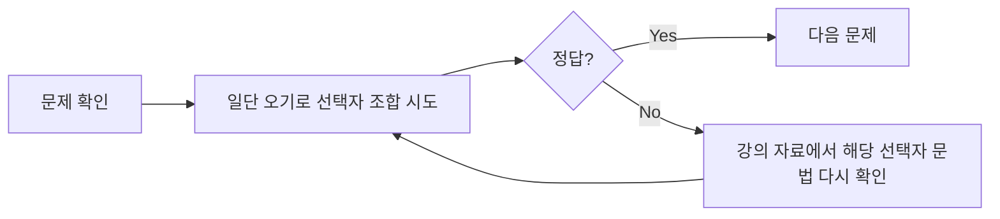

## 이론은 다 이해했다고 생각했다 (Situation)

어제 CSS 선택자 강의를 세 파트로 나눠 들었다. 전체·태그·ID·클래스 같은 기본 선택자부터, 속성 선택자와 후손·자손 선택자, `:hover`/`:active` 같은 반응 선택자, `:enabled`/`:disabled` 상태 선택자, 그리고 형제(동위) 선택자와 `:nth-child()` 구조 선택자, `:not()` 부정 선택자, `::selection` 문자 선택자까지 이어지는 내용이었다. 이론 설명을 들을 때는 각 선택자가 뭘 하는지 다 이해가 됐다.

## 문제 상황 (Task)

이론만 듣고 끝내면 진짜로 아는 건지 확신이 안 서서, 선택자 연습 게임인 [CSS Diner](https://flukeout.github.io/)를 풀어보기로 했다. 그런데 막상 접시(HTML 요소)를 선택자로 정확히 짚어내야 하는 문제 앞에 서니, 강의에서 이해했다고 생각했던 것과 실제로 손으로 써서 맞히는 것 사이에 꽤 큰 간극이 있었다. 개별 선택자 하나하나의 의미는 알아도, 그걸 여러 개 조합해서 "이 요소만" 골라내는 문제가 되면 자꾸 막혔다.

## 해결 과정 (Action)

### 1) 먼저 강의에서 정리한 선택자를 다시 훑어봤다

강의 자료(`01_css선택자1.html`, `02_css선택자2.html`, `03_css선택자3.html`)에 나온 선택자를 종류별로 정리하면 이렇다.

| 구분 | 선택자 예시 | 의미 |
|------|-------------|------|
| 기본 선택자 | `*`, `li`, `#id`, `.class` | 전체 / 태그 / ID / 클래스 |
| 속성 선택자 | `[name=name1]` | 특정 속성·속성값을 가진 요소 |
| 후손 선택자 | `div p` | `div` 하위의 모든 `p` (몇 단계든) |
| 자손(자식) 선택자 | `div > p` | `div` 바로 아래 있는 `p`만 |
| 형제(동위) 선택자 | `#a + div`, `#a ~ div` | 바로 다음 형제 / 이후의 모든 형제 |
| 반응 선택자 | `:hover`, `:active` | 마우스 오버 / 클릭 상태 |
| 상태 선택자 | `:enabled`, `:disabled` | 입력 요소의 활성/비활성 상태 |
| 구조 선택자 | `:first-child`, `:nth-child(2n)` | 형제 순서 기준으로 위치 선택 |
| 부정 선택자 | `:not(:nth-child(odd))` | 조건에 맞지 않는 요소 |
| 문자 선택자 | `::selection` | 드래그로 선택된 문자 영역 |

여기까지는 표로 정리하니 각각의 의미가 다시 또렷해졌다.

### 2) 그런데 문제를 풀 때는 표 순서대로 안 왔다

CSS Diner의 각 문제는 "이 표에 나온 개념 중 하나만" 묻지 않고, 후손 선택자와 형제 선택자를 같이 써야 하거나, 구조 선택자와 클래스 선택자를 동시에 조건으로 걸어야 하는 식으로 섞여 나왔다. 그래서 실제로 문제를 풀던 흐름은 이랬다.

먼저 기억나는 대로, 혹은 감으로 선택자를 조합해서 오기로 밀어붙여 봤다. 맞으면 그대로 넘어갔지만, 안 맞을 때는 어느 선택자 문법이 헷갈렸는지를 스스로 짚어본 다음 강의 자료를 다시 열어 그 부분만 콕 집어 확인했다. 예를 들어 후손 선택자(`div p`)와 자손 선택자(`div > p`)를 섞어 쓰다가 막힌 문제는, 파일에 정리해둔 "자손 선택자 : 바로 아래에 있는 요소 / 후손 선택자 : 하위 요소 전부"라는 설명을 다시 읽고 나서야 왜 범위가 다르게 잡히는지 이해가 됐다.

이 "오기로 시도 → 막히면 이론 재확인 → 다시 시도" 사이클을 반복하다 보니, 처음에는 시간이 걸리던 문제들도 점점 어떤 조합을 먼저 의심해야 할지 감이 붙기 시작했다.

## 결과 (Result)

정량적으로 "몇 번 만에 풀었다" 같은 지표를 남기진 못했지만, 체감 변화는 뚜렷했다. 강의만 듣고 끝났다면 후손 선택자와 자손 선택자, 형제 선택자의 차이를 안다고 착각한 채 넘어갔을 텐데, 직접 손으로 조합해보고 틀린 지점을 이론으로 되짚는 과정을 거치면서 각 선택자가 실제로 "어디까지" 선택하는지가 훨씬 명확해졌다.

가장 큰 배움은, CSS 선택자는 개별 문법을 아는 것과 여러 선택자를 조합해서 원하는 요소만 정확히 골라내는 것이 서로 다른 능력이라는 점이다. 이론 강의는 각 선택자의 정의를 알려주지만, 조합했을 때의 범위 감각은 직접 틀려보면서 몸에 익히는 수밖에 없었다.

## 더 학습하면 좋은 개념

- **명시도(Specificity)** — 여러 선택자가 같은 요소에 동시에 적용될 때 어떤 스타일이 이기는지 결정하는 규칙이다. 선택자를 조합해서 쓰다 보면 반드시 부딪히는 다음 문제다.
- **결합자(Combinator) 전체 정리** — 후손(` `), 자손(`>`), 인접 형제(`+`), 일반 형제(`~`) 네 가지를 한 번에 비교해서 표로 정리해두면 CSS Diner 같은 조합 문제에서 헷갈릴 일이 줄어든다.
- **가상 클래스(pseudo-class) vs 가상 요소(pseudo-element)** — `:hover`처럼 콜론 하나를 쓰는 것과 `::selection`처럼 콜론 두 개를 쓰는 것의 차이를 알아두면 문법을 헷갈리지 않는다.
- **CSS 우선순위 계산법(cascade)** — 명시도가 같을 때 순서(소스 코드에서 나중에 온 규칙)가 어떻게 작용하는지까지 알면, 선택자를 아무리 정확히 짜도 스타일이 안 먹히는 상황을 디버깅할 수 있다.

## 참고 자료

- [MDN - CSS 선택자 개요](https://developer.mozilla.org/ko/docs/Web/CSS/CSS_selectors)
- [MDN - 결합자(Combinator)](https://developer.mozilla.org/ko/docs/Web/CSS/CSS_selectors/Selector_structure)
- [MDN - 명시도(Specificity)](https://developer.mozilla.org/ko/docs/Web/CSS/Specificity)
- [MDN - 가상 클래스와 가상 요소](https://developer.mozilla.org/ko/docs/Web/CSS/Pseudo-classes)
- [CSS Diner - Where we feast on CSS Selectors!](https://flukeout.github.io/)
