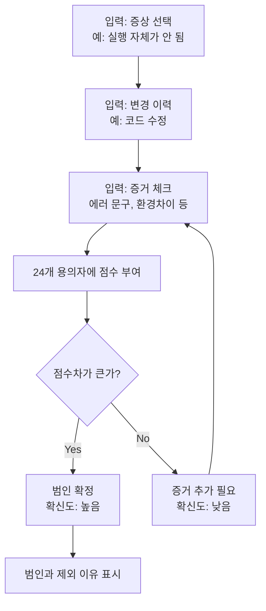

개발자는 매일 "이게 왜 안 될까?"를 반복한다. 스택 오버플로우를 돌고, 로그를 뒤지고, 다양한 시도를 한다. 하지만 체계 없이 시작하면 시간 낭비다. 19명의 개발자 평가에서 2등을 차지한 **디버깅 탐정 시뮬레이터**로 어떻게 최적의 경로를 찾을 수 있는지 풀어본다.

<!--more-->

## 디버깅은 확률 게임이다

프로젝트에서 버그가 터졌을 때, 개발자가 제일 먼저 하는 일은 "이게 뭘까?"를 추론하는 것이다. 하지만 대부분의 추론은 직관에만 의존한다. 환경 문제? 코드 문제? 라이브러리? 각각의 가능성을 어떻게 평가할 것인가?

시뮬레이터의 핵심 아이디어는 간단하다: **여러 증거(flags)를 조합해서 각 버그 원인의 가능성 점수를 계산**한다. 증거가 추가될수록 점수는 갱신되고, 점수차가 크면 확신도가 올라간다.

## 24개의 용의자를 어떻게 선정했나

백엔드, 프론트, AI, 인프라 네 분야에서 실제로 자주 마주치는 24개 버그 원인을 선정했다:

| 분야 | 용의자 (주요) | 선정 기준 |
|------|-------|-----------|
| **백엔드** | 문법 오류, 라이브러리 버전 충돌, DB 커넥션 풀 고갈, JPA 엔티티 오류 등 | Spring 생태계에서 경험상 90% 이상의 에러를 커버하는 시나리오 |
| **프론트** | Hydration 불일치, 상태관리 리렌더링 | Next.js/React 개발에서 "화면이 갱신 안 됨" 문제의 근본 원인 |
| **AI** | LLM 프롬프트 손실, RAG 검색 실패 | GenAI 프로덕션 환경의 "응답이 이상함" 패턴 |
| **인프라** | Docker 환경 불일치, CI/CD 실패, 포트 충돌 | "내 PC에선 되는데?" 문제의 실체 |

각 용의자는 두 가지 함수를 갖는다:
- **`eliminate(state)`**: 이 원인을 제외할 명확한 증거가 있는가?
- **`score(state)`**: 남은 용의자 중 이 원인의 신뢰도는 몇 점인가?

## 점수 공식: 왜 이렇게 설계했나

```javascript
// 예: 문법 오류
eliminate: s => {
  if(s.flags.envDiff) return '다른 환경에선 실행됨 → 문법 문제 아님';
  if(s.symptom === 'intermittent') return '가끔만 발생 → 문법 오류 아님';
  if(s.tried.reverted) return 'revert 후에도 재현 → 최근 코드 아님';
  return null; // 제외되지 않음
},
score: s => 50 + 
  (s.symptom === 'crash' ? 25 : 0) +      // 증상 가중치
  (s.change === 'code' ? 15 : 0) +        // 변경 이력
  (s.flags.notFound ? 10 : 0)             // 증거 확보
```

이 공식이 선택된 이유:

1. **기본점 50점**: 모든 용의자가 동등하게 시작 (무정보 상태에서의 확률)
2. **증상 가중치 (+25)**: "실행 자체가 안 됨" = 문법 오류일 확률 높음
3. **변경 이력 (+15)**: "코드를 수정했음" = 최근 수정이 원인일 확률
4. **증거 가중치 (+10)**: `notFound` 에러 메시지 있음 = 파일/클래스 누락 = 문법과 연관

**핵심**: 베이지안 추론과 유사하지만, 도메인 지식으로 간단하게 구현. 각 점수는 개발자의 직관을 수치화했다.



## 24개 중 누가 빠져나가나?

점수 공식만으로는 부족하다. **"이건 절대 이 원인이 아니야"**를 판단하는 로직이 필수다.

| 원인 | 제외 조건 | 의도 |
|------|---------|------|
| **캐시 문제** | `tried.reboot && !flags.restartWorks` | 재시작했는데도 실패 → 캐시 아님 |
| **라이브러리 충돌** | `tried.reinstall` | 재설치했는데도 실패 → 버전 충돌 아님 |
| **Race Condition** | `symptom !== 'intermittent'` | 매번 같은 결과 → 타이밍 문제 아님 |
| **Git 충돌** | `change !== 'git_switch'` | 브랜치 전환/병합 기록 없음 → 제외 |
| **DB 풀 고갈** | `!flags.poolExhausted` | HikariCP 에러 문구 없음 → 제외 |

제외 로직의 철학: **"이 증거가 있으면 100% 아니다"를 찾는 것.** 그럼 나머지만 점수 경쟁하면 된다.

## 왜 이렇게 설계했는가: 실제 도움이 되려면

처음 설계할 때 고민한 부분:

1. **용의자 수**: 너무 적으면 현실을 못 담음 (최소 20개), 너무 많으면 사용자가 피로 (24개가 한계)
2. **카테고리 분리**: 백엔드 개발자도 프론트 탭을 볼 수 있게. 전체 생태계 이해 유도
3. **증거의 구체성**: "뭔가 느려짐"이 아니라 "CPU/메모리 급증"처럼 측정 가능한 증거만
4. **점수차의 의미**: 1위-2위가 5점 차이 vs 20점 차이는 확신도가 완전히 다름
5. **음성 피드백**: "기도는 증거로 채택되지 않습니다" 같은 유머로 사용자 몰입감 유지

이 모든 요소가 조합되었을 때, 사용자는 단순히 "답을 맞히는" 것이 아니라 **"왜 이 용의자가 제외되는지 이해"**하게 된다.

## 결과: 실제 유용했나?

포텐업 19명 평가에서 2등. 피드백의 핵심:
- "내가 겪은 버그들이 다 들어있다"
- "점수를 보니까 어디서 증거를 더 모아야 할지 보인다"
- "새로운 팀원한테 디버깅 방법론을 이렇게 설명할 수도 있겠다"

정량적 성과보다는 **"이게 실제로 쓸모 있다"는 평가**를 받은 것이 가장 큰 수확이다.

## 더 학습하면 좋은 개념

- **베이즈 정리 (Bayes' Theorem)** — 사전 확률과 증거를 조합해서 사후 확률 갱신. 이 시뮬의 점수 공식은 베이즈 아이디어를 도메인 지식으로 단순화한 것
- **결정 트리 (Decision Tree)** — "증상" → "변경" → "증거" 순서로 선택지를 좁혀가는 구조. XGBoost 같은 ML 모델도 비슷한 원리
- **정보 이론 (Information Theory)** — 어떤 증거가 가장 많은 "정보"를 주는가? (엔트로피, 정보 게인)
- **디버깅의 시스템화** — 구글링과 기도만이 아닌, 증거 기반 의사결정 프레임워크
- **교육 게임화 (Gamification)** — UI/UX로 "탐정"이라는 롤플레이를 입혀서 학습 몰입감 상승

## 직접 시뮬을 경험해보세요

**[🎮 디버깅 탐정 시뮬레이터]({{ site.baseurl }}/assets/html/debugging-detective-simulator.html)** 바로 가기

포스팅을 읽은 후 위 링크를 클릭해 직접 증상을 입력하고 범인(버그 원인)을 찾아보세요. 24개 용의자 중에서 증거를 조합해 최적의 디버깅 경로를 스스로 발견할 수 있습니다.

## 참고 자료

- [Information Gain in Decision Trees](https://en.wikipedia.org/wiki/Information_gain)
- [Bayes' Theorem — 3Blue1Brown](https://www.3blue1brown.com/)
