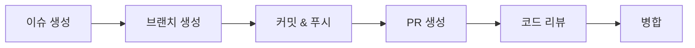

혼자 쓰던 Git과 팀으로 쓰는 Git은 다르다. 오늘 SHY팀 협업 드릴로 이슈→브랜치→PR→리뷰→병합 전 과정과, 사고가 났을 때 되돌리는 법까지 실습했다.

<!--more-->

## 왜 협업 드릴이 필요했나

기획을 마친 뒤, 형상관리자가 세운 규칙 아래 실제로 이슈를 만들고 PR을 올려보는 실습을 했다. 오늘 강의 전체가 "혼자 실습"이 아니라 "팀으로 실습"이었던 이유가 여기 있다 — 워크플로 자체는 알아도, 충돌이나 실수가 발생하는 시점은 여러 명이 동시에 건드릴 때만 재현된다.

## 기본 흐름: 이슈 → 브랜치 → PR → 리뷰 → 병합



- **이슈 템플릿**: 버그/기능 요청마다 정해진 양식(재현 방법, 기대 결과 등)을 채우게 강제
- **PR 템플릿**: 변경 사항 요약, 테스트 방법을 PR 설명에 고정 양식으로 남김
- **`Closes #N`**: PR 설명에 이 키워드를 쓰면 병합 시 연결된 이슈가 자동으로 닫힌다

```bash
git checkout -b feature/login-form
# 작업 후
git add .
git commit -m "feat: add login form validation"
git push origin feature/login-form
# PR 생성 시 본문에 "Closes #12" 포함
```

## 뒤처진 PR 충돌 해결

다른 팀원이 먼저 병합하면서 내 브랜치가 뒤처지는 상황을 실습했다. 핵심은 **내 브랜치에 선 채로 main을 merge**하는 것.

```bash
git checkout feature/login-form
git fetch origin
git merge origin/main
# 충돌 발생 시 해당 파일 직접 수정 후
git add <충돌났던 파일>
git commit
git push origin feature/login-form
```

rebase가 아니라 merge를 쓰는 이유는 공통 규칙 때문이다 — PR 브랜치에서 rebase를 하면 이미 원격에 올라간 커밋 히스토리가 바뀌어 강제 푸시가 필요해지고, 팀원과 충돌할 위험이 커진다.

## 병합된 PR 되돌리기: Revert

병합 후 문제가 발견됐을 때 GitHub의 **Revert 버튼**으로 되돌리는 걸 실습했다. `git reset --hard`처럼 히스토리를 지우는 게 아니라, "되돌리는 새 커밋"을 추가하는 방식이라 히스토리가 보존된다.

| 방식 | 히스토리 | 팀 작업 안전성 |
|------|----------|----------------|
| `git reset --hard` | 삭제됨 | 이미 push된 경우 위험 (다른 사람 로컬과 어긋남) |
| GitHub Revert | 보존됨 (되돌리는 커밋 추가) | 안전, 누가 언제 되돌렸는지도 기록됨 |

## .env 커밋 사고 대응

실수로 `.env` 같은 비밀 파일을 커밋했을 때의 대응도 다뤘다. 핵심은 두 가지다.

1. `.gitignore`에 등록해서 **앞으로는** 안 올라가게 막는다
2. 하지만 **이미 커밋된 히스토리에는 여전히 남아있다** — `.gitignore`는 미래의 커밋만 막을 뿐, 과거 커밋을 지우지 않는다

히스토리에서 완전히 지우려면 `git filter-repo` 같은 별도 도구가 필요하고, 이미 push된 경우엔 노출된 키/비밀값 자체를 폐기(rotate)하는 게 우선이라는 점이 실무적으로 중요했다.

## git stash로 급한 PR 처리

작업 중이던 코드를 커밋하지 않은 상태에서 급하게 다른 브랜치의 PR을 리뷰/수정해야 하는 상황을 연습했다.

```bash
git stash push -m "로그인 폼 작업 중"
git checkout hotfix-branch
# 급한 작업 처리
git checkout feature/login-form
git stash pop
```

`stash`는 커밋하기엔 애매한 미완성 작업을 임시로 치워두는 용도라, 협업 중 브랜치를 급하게 오갈 때 유용하다는 걸 체감했다.

## 릴리스 태그와 CHANGELOG

```bash
git tag -a v0.1 -m "첫 번째 스프린트 릴리스"
git push origin v0.1
```

태그로 특정 시점을 릴리스로 고정하고, `CHANGELOG.md`에 버전별 변경사항을 기록하는 방식을 실습했다. 스프린트 리뷰에서 "이번 스프린트에 뭐가 바뀌었는지"를 보여줄 때 CHANGELOG가 바로 그 근거 문서가 된다.

## 팀 공통 규칙

- **main에 직접 push 금지** — 반드시 PR을 통해서만 병합
- **`reset --hard` / `rebase` / `push --force` 금지** — 히스토리를 보존하는 **revert**만 사용

이 두 규칙은 "혼자 할 땐 편한 명령어가, 팀에서는 왜 위험한지"를 압축해서 보여준다. 히스토리를 지우거나 바꾸는 명령은 로컬에서는 문제없지만, 이미 원격에 공유된 순간 다른 사람의 작업 기준점을 무너뜨린다.

## 더 학습하면 좋은 개념

- **`git rebase -i`와 커밋 정리** — 오늘은 팀 규칙상 금지했지만, 개인 브랜치(원격 미공유 상태)에서 커밋을 정리할 때 왜 유용한지 알아두면 언제 써도 되는지 판단할 수 있다.
- **`git filter-repo` / BFG Repo-Cleaner** — `.env` 사고처럼 히스토리에서 민감 정보를 완전히 제거해야 할 때 쓰는 도구.
- **Conventional Commits** — `feat:`, `fix:` 같은 커밋 메시지 규칙. CHANGELOG를 자동 생성하는 도구들의 기반이 된다.
- **브랜치 보호 규칙 (Branch Protection Rules)** — "main 직접 push 금지"를 사람의 규율이 아니라 GitHub 설정으로 강제하는 방법.
- **Semantic Versioning (SemVer)** — `v0.1` 같은 태그를 어떤 기준으로 올릴지(`v1.0.0`, `v1.1.0`, `v1.1.1`)를 정하는 표준.

## 참고 자료

- [GitHub Docs - About pull request merges](https://docs.github.com/en/pull-requests/collaborating-with-pull-requests/incorporating-changes-from-a-pull-request/about-pull-request-merges)
- [GitHub Docs - Reverting a pull request](https://docs.github.com/en/pull-requests/collaborating-with-pull-requests/incorporating-changes-from-a-pull-request/reverting-a-pull-request)
- [Git 공식 문서 - git-stash](https://git-scm.com/docs/git-stash)
- [Conventional Commits](https://www.conventionalcommits.org/)
