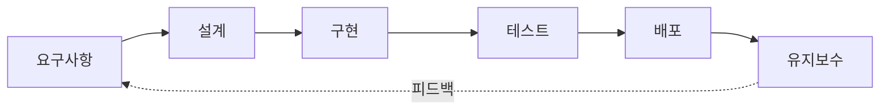
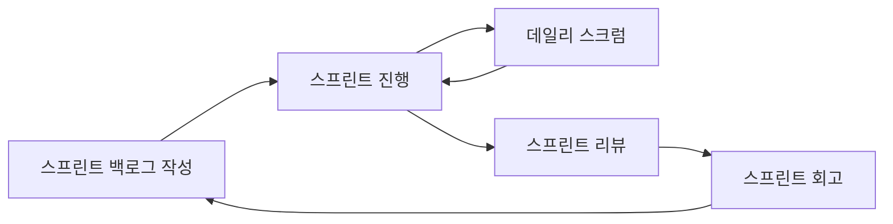

워터폴과 애자일을 "둘 다 안다"고 생각했는데, 왜 스크럼에 역할이 세 개로 나뉘어 있는지는 설명 못 했다. 오늘 이론 수업에서 그 빈틈을 메운 내용을 정리한다.

<!--more-->

## 코드를 짜기 전에 알아야 했던 용어들

서버 개발자로서 "일단 짜고 본다"는 습관이 있었는데, 오늘 수업은 그 앞단부터 짚었다.

- **프로그램**: 명령어의 집합
- **애플리케이션**: 특정 목적을 위해 프로그램을 조합한 것
- **소프트웨어**: 프로그램 + 데이터 + 문서를 포괄하는 더 큰 개념
- **프로세스**: 소프트웨어를 만드는 절차 자체

그리고 프로세스는 혼자 완성되지 않는다. **인력·프로세스·도구** 세 요소가 맞물려야 한다는 게 오늘 강의의 전제였다. 도구(Git, CI/CD)만 좋아도, 프로세스(워터폴/애자일)만 알아도 부족하고, 결국 사람이 그 사이를 채운다.

## SDLC: 6단계는 왜 이 순서인가

**요구사항 → 설계 → 구현 → 테스트 → 배포 → 유지보수**

포인트는 앞 단계의 오류가 뒷 단계로 갈수록 수정 비용이 기하급수적으로 커진다는 것. 요구사항 단계에서 놓친 실수를 배포 후 발견하면, 코드 수정이 아니라 설계 자체를 다시 해야 하는 경우가 생긴다.

## 워터폴 vs 애자일: 뭐가 다른가

| 항목 | 워터폴 | 애자일 |
|------|--------|--------|
| 진행 방식 | 순차적, 단계별 완료 후 다음 단계 | 반복적(스프린트), 짧은 주기로 완성 |
| 요구사항 변경 | 어려움 (초기 확정 전제) | 유연함 (스프린트마다 반영 가능) |
| 문서화 | 상세하고 무거움 | 가벼움, 동작하는 소프트웨어 우선 |
| 적합한 프로젝트 | 요구사항이 명확하고 안정적인 경우 | 요구사항이 자주 바뀌는 경우 |
| 리스크 발견 시점 | 프로젝트 후반부 | 스프린트마다 조기 발견 |

워터폴이 "구식"이라 애자일을 쓰는 게 아니라, **요구사항 변동성**이 선택 기준이라는 걸 이번에 명확히 했다. 정부 발주 프로젝트처럼 스펙이 계약으로 고정된 경우엔 여전히 워터폴이 합리적이다.

## 애자일 & 스크럼: 역할과 이벤트

스크럼은 애자일을 실행하는 구체적인 프레임워크 중 하나다.

**3대 역할**

| 역할 | 책임 |
|------|------|
| 제품 책임자 (PO) | 백로그 우선순위 결정, "무엇을" 만들지 결정 |
| 스크럼 마스터 | 프로세스가 원활히 돌아가게 하는 퍼실리테이터, 장애물 제거 |
| 스크럼 팀 | 실제로 "어떻게" 만들지 결정하고 구현 |

**스프린트 사이클**

- **스프린트 백로그**: 이번 스프린트에서 할 일 목록 (제품 백로그에서 뽑아온 부분집합)
- **데일리 스크럼**: 매일 15분 내외, 어제 한 일 / 오늘 할 일 / 방해 요소 공유
- **스프린트 리뷰**: 완성된 결과물을 이해관계자에게 시연, 피드백 수집
- **스프린트 회고**: 팀 내부적으로 "프로세스" 자체를 개선하는 시간 (리뷰와 목적이 다름)

리뷰는 **결과물**을 보는 자리, 회고는 **과정**을 보는 자리라는 구분이 헷갈렸는데 이번에 정리됐다.

## 요구사항: 기능적 vs 비기능적

| 구분 | 정의 | 예시 |
|------|------|------|
| 기능적 요구사항 | 시스템이 "무엇을" 해야 하는가 | 로그인, 결제, 검색 |
| 비기능적 요구사항 | 시스템이 "얼마나 잘" 해야 하는가 | 응답속도 300ms 이내, 99.9% 가용성 |

서버 엔지니어 입장에서 비기능적 요구사항(성능, 보안, 확장성)이 종종 "당연히 잘 되겠지"로 넘어가는데, 명세서에 수치로 못 박지 않으면 테스트 기준 자체가 없다는 게 오늘 강의의 핵심 지적이었다.

**추출 방법**: 인터뷰, 워크숍, 설문 — 각각 깊이(인터뷰) vs 합의(워크숍) vs 규모(설문)라는 트레이드오프가 있다.

**명세서 작성 5원칙**: 명확성, 완전성, 일관성, 추적가능성, 검증가능성. 이 중 **추적가능성**(요구사항 → 설계 → 코드 → 테스트케이스가 연결되어 있는가)이 실무에서 가장 자주 빠지는 부분이라고 느꼈다. 요구사항이 바뀌었을 때 어떤 코드를 고쳐야 하는지 추적이 안 되면 변경 관리 자체가 불가능해진다.

## 더 학습하면 좋은 개념

- **스크럼 가이드 (Scrum Guide)** — 오늘 배운 역할/이벤트의 1차 출처. 임의로 변형된 "사내 스크럼"과 원문의 차이를 비교해보면 좋다.
- **칸반(Kanban)** — 스프린트 없이 흐름(Flow) 기반으로 일하는 또 다른 애자일 방법론. 스크럼과의 차이를 알면 팀 상황에 맞는 프로세스 선택이 쉬워진다.
- **요구사항 추적 매트릭스(RTM)** — 추적가능성 원칙을 실제 문서로 구현하는 방법.
- **DoD(Definition of Done)** — 스프린트 리뷰에서 "완료"의 기준을 팀이 합의해두는 개념. 없으면 리뷰 때마다 기준이 흔들린다.
- **비기능 요구사항 명세 표준 (ISO/IEC 25010)** — 성능, 보안, 유지보수성 등을 체계적으로 분류하는 표준. 비기능 요구사항을 "느낌"이 아니라 카테고리로 정리할 때 참고할 만하다.

## 참고 자료

- [Scrum Guide (공식)](https://scrumguides.org/)
- [Atlassian - Waterfall vs Agile](https://www.atlassian.com/agile/project-management/project-management-intro)
- [ISO/IEC 25010 소개](https://iso25000.com/index.php/en/iso-25000-standards/iso-25010)
