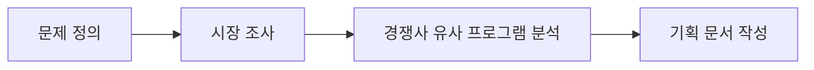

오늘 수업의 진짜 목표는 이론 강의가 아니라 **팀을 짜서 실제로 프로젝트를 기획해보는 것**이었다. SHY팀의 리서처를 맡아 문제를 발굴한 과정을 기록한다.

<!--more-->

## 이론은 도구였고, 오늘의 본 작업은 기획이었다

앞선 SDLC/애자일 이론 수업은 사실 워밍업이었다. 오늘 수업의 중심은 **팀을 구성하고, 그 팀이 실제로 만들 프로젝트를 기획하는 것**. 이론에서 배운 "요구사항은 인터뷰·워크숍·설문으로 추출한다"는 원칙을 바로 오늘 팀 활동에 적용해야 했다.

## SHY팀 역할 분담

세 명이 팀을 이뤄 각자 다른 역할을 맡았다.

| 역할 | 담당 업무 |
|------|-----------|
| 형상관리자 | Git 브랜치 전략, 이슈/PR 템플릿 관리, 저장소 규칙 수립 |
| 프로덕트매니저 | 백로그 우선순위, 일정 관리, 기획 문서 총괄 |
| 리서처 (본인) | 현실 세계의 불편한 점 발굴, 시장/경쟁사 조사 |

리서처로 배정받고 나서 처음 든 생각은 "그냥 아이디어 브레인스토밍이겠지"였는데, 실제로는 **"문제 정의 → 시장 조사 → 경쟁사 분석"**이라는 명확한 순서가 있었다. 아이디어를 먼저 내고 문제를 끼워맞추는 게 아니라, 문제부터 확정하고 그 문제가 시장에서 어떻게 다뤄지고 있는지를 조사하는 방식이다.

## 리서처가 실제로 한 일: 문제 발굴

리서처의 역할은 "현실 세계의 불편한 점을 찾는 것"이었다. 막연히 "불편한 거 없나" 하고 생각하면 아무것도 안 나오는데, 아래 4항목 틀에 맞춰 정리하니 구조가 잡혔다.

**기획 문서 4항목 틀**

| 항목 | 질문 |
|------|------|
| 1. 문제 | 정확히 무엇이 불편한가? |
| 2. 대상 | 이 불편함을 겪는 사람은 누구인가? |
| 3. 현재 해법 | 지금은 이 문제를 어떻게 해결하고 있는가? |
| 4. 불편 | 그 현재 해법의 어떤 점이 부족한가? |

이 틀의 핵심은 3번(현재 해법)이다. "현재 해법이 없다"는 답은 대부분 틀렸다 — 사람들은 어떻게든 임시방편으로 문제를 해결하고 있고, 그 임시방편의 한계가 바로 우리가 채울 자리다. 이론 수업에서 배운 요구사항 추출 방법(인터뷰·워크숍·설문) 중 무엇을 쓸지도 이 단계에서 같이 고민했다.

## 서버 엔지니어 지망생 관점에서 느낀 점

기획 단계에서도 벌써 백엔드적으로 생각하게 됐다. "이 불편함을 해결하려면 어떤 데이터가 필요한가", "실시간성이 필요한 문제인가, 배치로 처리해도 되는 문제인가" 같은 질문이 리서치 단계에서부터 나왔다. 기획과 구현이 완전히 분리된 단계가 아니라, 리서처가 문제를 어떻게 정의하느냐에 따라 이후 아키텍처 선택지가 달라진다는 걸 체감했다.

## 더 학습하면 좋은 개념

- **제품 백로그 (Product Backlog)** — 오늘 발굴한 문제들이 다음 단계에서 어떻게 백로그 아이템으로 변환되는지 알면 PM 역할과의 협업이 쉬워진다.
- **린 캔버스 (Lean Canvas)** — 문제-대상-현재해법-불편 4항목 틀을 더 확장한 1페이지 기획 프레임워크. 다음 기획 단계에서 참고할 만하다.
- **페르소나(Persona) 설계** — "대상"을 구체화하는 기법. 막연한 "사용자"가 아니라 구체적 인물로 그려야 요구사항이 명확해진다.
- **경쟁 분석 매트릭스** — 유사 프로그램을 기능/가격/타겟 축으로 비교 정리하는 방법. 다음 리서치 단계에서 바로 쓸 수 있다.
- **JTBD(Jobs To Be Done)** — "현재 해법"을 분석할 때, 사용자가 그 해법으로 실제로 해결하려는 "일"이 무엇인지 파고드는 프레임워크.

## 참고 자료

- [Scrum Guide - Product Backlog](https://scrumguides.org/scrum-guide.html#product-backlog)
- [Lean Canvas 소개 - Lean Stack](https://leanstack.com/lean-canvas)
