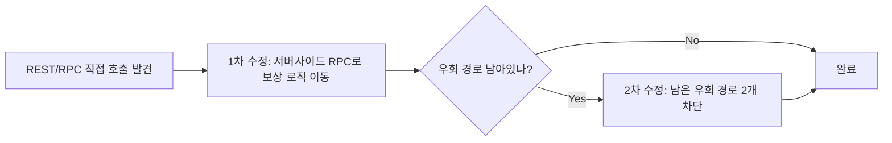

2026년 9월 7일부터 9월 22일까지, 3명이서 공유 가계부 앱 "ShooT"를 기획부터 배포까지 끝낸 팀 프로젝트 회고, 그리고 마지막 날 발견한 보안 구멍을 막은 이야기.

<!--more-->

## 다른 팀은 4명인데, 우리는 3명이었다 (Situation)

2026년 9월 7일부터 22일까지, 3명이 팀을 이뤄 "ShooT"라는 공유 가계부 앱을 만들었다. 영수증을 찍으면 OCR로 지출이 자동 입력되고, 그룹원끼리 지출을 공유하며, 저축을 하면 반려 캐릭터가 자라는 컨셉이다. 이종민이 형상관리, 신아림이 PM, 내가 리서처를 맡았다. 다른 팀들이 보통 4명으로 구성된다는 걸 알고 처음엔 인원이 부족한 게 걱정이었다.

## 문제 상황 (Task)

리서처로서 초반 기획 문서(문제 정의·워크플로·요구사항) 작성과, 저축하면 성장하는 반려 캐릭터 기능 구현, 그리고 프로젝트 마지막 날의 보안 점검까지 맡았다. 2주라는 짧은 기간 안에 기획-구현-배포를 다 끝내야 했고, 인원이 적은 만큼 한 사람이 맡는 범위가 넓었다.

## 해결 과정 (Action)

### 기획 문서를 추적 가능하게 번호로 엮었다

요구사항부터 화면까지 한 줄로 추적할 수 있도록 문서 체계를 잡았다.

| 문서 | 내용 |
|------|------|
| 01-problem | 문제 정의 |
| 02-workflow | 사용자 워크플로 |
| 03-requirements (R) | 요구사항 |
| 04-features (F) | 기능 정의 |
| 05-policy (P) | 정책 |
| 06-data (E) | 데이터 모델 |
| 07-screens | 화면 명세 |
| 08-pet-feature-spec | 반려 캐릭터 기능 명세 |

예를 들어 `R14 → F14 → P6 → E4 → screen7`처럼 요구사항 하나가 어떤 기능·정책·데이터·화면으로 이어지는지 번호로 바로 찾을 수 있게 했다. 3명뿐이라 별도 협업 툴 없이도 문서 하나로 서로 뭘 하고 있는지 파악이 됐다.

### 반려 캐릭터 기능, 만들고 보니 튜닝이 반이었다

저축하면 자라는 반려 캐릭터를 만들면서 스프라이트 조각을 이어붙이는 경계에서 색이 번지는 버그를 잡았고, XP 곡선과 먹이 비용, 그룹 단위로 같이 먹이를 주는 기능까지 경제 시스템을 여러 차례 다시 손봤다. 시연을 앞두고는 "팀장 계정만 하루 1회 밥주기 제한 면제" 같은 임시 예외를 넣고, 시연이 끝나면 바로 되돌릴 파일까지 미리 준비해뒀다.

3명이 동시에 마이그레이션 파일을 늘리다 보니 번호가 겹치는 일도 있었다. 두 사람이 각자 019, 020번을 썼다가 충돌이 나서 025~030번으로 재번호를 매겨 정리했다.

### 마지막 날, 보안 구멍을 두 번에 걸쳐 막았다

프로젝트 마지막 날인 22일, 클라이언트에서 Supabase REST/RPC를 직접 호출하면 게임 경제(코인·XP)나 그룹 권한을 조작할 수 있다는 걸 발견했다. 1차로 막았는데, 바로 다음 커밋에서 "남아있던 우회 경로 두 개"를 추가로 발견해서 다시 막아야 했다.

보상 지급 계산을 클라이언트가 아니라 서버 RPC에서만 하도록 옮기고, `pets` 테이블의 경제 관련 컬럼은 컬럼 단위로 권한을 잠갔다. 한 번에 끝났다고 생각한 보안 수정이 실제로는 두 단계였다는 게, 짧은 기간 동안 가장 꼼꼼하게 봐야 했던 부분이었다.

## 결과 (Result)

3명이라는 제약을 오히려 활용해서 의사결정 라인을 단순하게 유지한 채 2주 안에 기획-구현-배포를 끝냈다. 특히 마지막 날 두 차례에 걸쳐 서버사이드 검증으로 전환한 덕분에, 클라이언트 요청 조작만으로 코인·XP를 무한정 생성하거나 다른 그룹의 소유자로 자신을 등록하는 구멍을 막을 수 있었다. 배포 직전까지 꼼꼼하게 다시 점검하는 과정이 힘들었지만, "한 번 고쳤다"에서 끝내지 않고 "정말 다 막혔나"를 다시 확인하는 습관의 중요성을 배웠다.

## 더 학습하면 좋은 개념

- **Supabase RLS(Row Level Security)** — DB 행 단위로 접근 권한을 제어하는 방식이다. 이번 프로젝트의 보안 수정이 결국 "클라이언트를 믿지 않고 서버(DB)에서 검증"하는 방향이었는데, RLS가 그 핵심 원리다.
- **RPC 기반 서버사이드 검증** — 클라이언트가 값을 직접 계산해서 보내는 대신, 서버 함수(RPC)가 계산과 검증을 전담하게 만드는 패턴. 보상·게임 경제처럼 조작 가능성이 있는 로직에는 필수적이다.
- **DB 마이그레이션 버전 관리** — 여러 명이 동시에 스키마를 바꿀 때 번호 충돌이 나는 이유와, 이를 방지하는 팀 컨벤션(브랜치별 번호 대역 나누기 등)을 알아두면 이번에 겪은 문제를 재발 방지할 수 있다.
- **요구사항 추적성(Traceability)** — 요구사항-기능-정책-데이터-화면을 번호로 엮는 방식은 소규모 팀에서도 문서가 흩어지지 않게 해주는 방법론이다.

## 참고 자료

- [Supabase 공식 문서 - Row Level Security](https://supabase.com/docs/guides/database/postgres/row-level-security)
- [Supabase 공식 문서 - Database Functions (RPC)](https://supabase.com/docs/guides/database/functions)
- [Git 공식 문서 - Merging Branches](https://git-scm.com/book/en/v2/Git-Branching-Basic-Branching-and-Merging)
