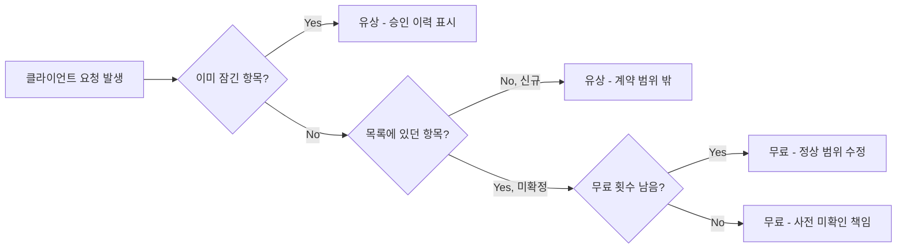

프리랜서와 클라이언트 모두가 겪는 "이거 유상이야, 무상이야?" 문제를, 판정 기준이 되는 화면 하나로 풀어본 개인 프로젝트 "Fix" 이야기.

<!--more-->

## 작업 한창일 때 오는 그 연락 (Situation)

작업이 한창일 때 연락이 온다. "여기 이것만 살짝 바꿔주세요." 프리랜서는 안다, 이건 처음 얘기한 범위가 아니라는 걸. 그런데도 그 말을 꺼내기가 어렵다. 추가비를 일일이 말해야 하는 것 자체가 부담이고, 그렇다고 매번 참고 넘어가면 그게 쌓인다. 반대로 클라이언트 입장에서도, 결과물을 받는 마지막 순간에 갑자기 추가비를 요구받으면 "왜 이제 와서 말하지?"라는 생각이 든다. 사실 프리랜서도 처음부터 말하고 싶었지만, 말할 타이밍과 근거가 없었을 뿐이다.

## 문제 상황 (Task)

이건 둘 중 누가 나빠서 생기는 문제가 아니다. **판정 기준이 없어서 생기는 문제**다. 우리 중 누군가는 프리랜서가 되고, 또 누군가는 외주를 맡기는 입장이 된다. 그래서 어느 한쪽이 아니라 양쪽 모두를 위한 도구가 필요했다 — "이 요청이 유상인지 무상인지"를 사람이 매번 판단하고 말하는 대신, 화면이 먼저 판정해주는 방식으로.

## 해결 과정 (Action)

### 횟수를 세지 말고, 결정을 잠근다

수정 횟수를 카운트하는 방식 대신, "확정한 항목은 승인되는 순간 잠긴다"는 개념으로 설계했다. 요청이 들어오면 아래 기준으로 유상/무료가 자동으로 갈린다.

| 요청이 걸리는 항목 | 판정 | 근거 |
|------|------|------|
| 잠긴 항목 | 유상 | "본인이 승인함" 이력이 남아있음 |
| 목록에 없는 신규 요구 | 유상 | 애초에 계약 범위 밖 |
| 미확정 항목 | 무료 | 작업 전에 물어보지 않은 쪽(프리랜서) 책임 |
| 확정 전 + 무료 횟수 남음 | 무료 | 정상 범위의 수정 |

이 도구는 프리랜서 편만 들지 않는다. 확정해두지 않은 항목은 무료로 처리되도록 만들어서, 사전에 조건을 명확히 안 정한 쪽의 책임도 함께 지도록 했다.

### 직종별 체크리스트 + 승인 = 그 순간 잠금

배포된 화면([freelancer-code.vercel.app](https://freelancer-code.vercel.app/))에서는 프로젝트를 만들 때 개발·외주디자인·영상 편집·번역·촬영 같은 직종을 고르면 그에 맞는 확정 항목 체크리스트가 뜨도록 했다. 승인은 클라이언트가 화면에서 직접 눌러야 하고, 그 순간 항목이 잠긴다 — 즉 "정해놓은 걸 다시 바꾸자는 요청인가"를 사람이 아니라 그 클릭 하나가 판정한다. 승인·요청 이력은 시간순으로 남아서, 나중에 다툼이 생겨도 양쪽 다 근거로 쓸 수 있다.

로그인도 없앴다. 작업자용 링크와 클라이언트용 링크를 따로 만들어서(사이트에는 QR 코드로도 제공), 링크를 받는 순간 그 역할의 권한이 그대로 생기는 구조다. 클라이언트도 가입 없이 링크만 열면 바로 참여할 수 있다.

## 결과 (Result)

freelancer-code.vercel.app에 배포까지 마쳤고, 사용 지표를 뽑을 만큼 운영해본 건 아니라 정량적인 수치는 아직 없다. 다만 "유상이냐 무상이냐"를 사람이 말로 설명해야 했던 상황을, 화면이 먼저 판정해서 보여주는 흐름으로 바꿔냈다는 점이 이번 프로젝트의 핵심 결과다. 이 구조는 소프트웨어 외주에만 한정되지 않는다 — 맞춤 가구, 주문 제작 케이크, 인쇄물처럼 "조건을 정하고 그대로 만드는" 모든 주문 제작 관계로 확장할 수 있다는 걸 만들면서 깨달았다.

## 더 학습하면 좋은 개념

- **상태 기계(State Machine)** — "미확정 → 확정(잠김)"처럼 항목이 명확한 상태를 오가며 되돌릴 수 없는 전이를 하는 구조는 상태 기계로 모델링하면 더 견고하게 설계할 수 있다.
- **링크 기반 접근 제어(Capability URL)** — 로그인 없이 링크 자체가 권한이 되는 방식은 편리하지만, 링크 유출 시 위험도 함께 커진다. 이 트레이드오프를 다루는 개념을 더 학습해두면 좋다.
- **감사 로그(Audit Log)** — 승인·요청 이력을 시간순으로 남기는 기능은 감사 로그 설계의 기본기다. 나중에 분쟁 상황에서 근거로 쓰이는 데이터인 만큼 무결성 있게 남기는 방법을 더 파보면 좋다.
- **UX 라이팅으로 신뢰 설계하기** — "사람이 말하지 않는다, 화면이 먼저 말한다"는 이 프로젝트의 핵심 문구인데, 민감한 판정을 UI 문구와 흐름만으로 부담 없이 전달하는 것도 별도의 기술이다.

## 참고 자료

- [Next.js 공식 문서](https://nextjs.org/docs)
- [Vercel 공식 문서 - Deployments](https://vercel.com/docs/deployments/overview)
