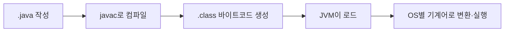

추석 연휴 이후 다시 시작한 자바 수업, 인텔리제이로 실습하며 배운 실행 구조·변수·형변환·연산자를 정리한 학습 노트다.

<!--more-->

## 인텔리제이 켜고 처음 만난 자바 (Situation)

추석 연휴가 끝나고 인텔리제이(IntelliJ)로 자바 수업을 다시 시작했다. `chap01-java-basic` 모듈에서 `Helloworld.java`부터 시작해 실행 구조, 리터럴과 변수, 형변환, 연산자까지 순서대로 실습했다.

## 배운 내용 (Task)

이번 시간의 목표는 자바 프로그램이 어떻게 실행되는지, 그리고 변수·자료형·연산자의 기본 문법을 코드로 직접 확인하는 것이었다.

## 정리한 내용 (Action)

### 자바 코드가 실행되는 과정

모든 자바 코드는 클래스 내부에 작성하고, `main()` 메서드가 프로그램의 시작점이 된다.



```java
public class Main {
    public static void main(String[] args) {
        System.out.println("Hello World!");
    }
}
```

### 리터럴과 변수, 자료형별 크기

리터럴은 정수·실수·문자·문자열·논리 같은 순수한 "값"을 의미한다. 자료형마다 저장하는 메모리 크기가 다르다.

| 구분 | 자료형 | 크기 |
|------|--------|------|
| 정수 | `byte` / `short` / `int` / `long` | 1 / 2 / 4 / 8 byte |
| 실수 | `float` / `double` | 4 / 8 byte |
| 문자 | `char` | - |
| 문자열 | `String` | - |
| 논리 | `boolean` | - |

같은 영역(`{}`) 안에서는 동일한 변수명을 두 번 쓸 수 없고, 변수는 "선언"과 "초기화"를 구분해서 쓸 수 있다는 것도 확인했다.

```java
int num;   // 선언
num = 30;  // 초기화

int num2 = 10; // 선언과 동시에 초기화
```

### 형변환 — 암시적 vs 명시적

형변환(Type Conversion)은 데이터 타입을 다른 타입으로 바꾸는 과정이다.

| 구분 | 방식 | 특징 |
|------|------|------|
| 암시적(묵시적) 형변환 | `int` → `double`처럼 자동으로 변환 | 데이터 손실 없음 |
| 명시적 형변환 | `(int)dnum`처럼 직접 타입을 지정 | 데이터 손실 가능성이 있어 컴파일러가 강제로 명시하게 함 |

```java
double dnum = 99.99;
int inum = (int)dnum; // 명시적 형변환, 소수점 손실

int num2 = 100;
double dnum2 = num2;  // 암시적 형변환, 손실 없음
```

### 연산자 — 산술·비교·논리·증강

산술 연산에서는 `%`(나머지)가 추가로 있다는 점, 문자열과 숫자를 `+`로 연결하면 숫자가 문자열로 변환된다는 점을 코드로 확인했다.

```java
System.out.println("나눗셈 : " + (a / b));  // 몫
System.out.println("나머지 : " + (a % b));  // 나머지
```

증강 연산자는 전위(`++age`)와 후위(`age++`)의 동작 차이가 핵심이다.

```java
int age = 20;
System.out.println(++age); // 21 - 먼저 증가시키고 반환
System.out.println(age++); // 21 - 먼저 반환하고 증가
System.out.println(age);   // 22
```

## 정리 (Result)

오늘은 특별히 헷갈렸던 부분 없이, 자바 실행 구조부터 변수·형변환·연산자까지 기본기를 순서대로 훑었다. 다음 수업에서 이어질 조건문·반복문의 토대가 되는 내용이라 표로 정리해두니 나중에 다시 찾아보기 편할 것 같다.

## 더 학습하면 좋은 개념

- **JVM과 바이트코드** — `.class` 파일을 JVM이 어떻게 해석해서 OS별 기계어로 바꾸는지 더 깊이 알아두면, "자바는 왜 OS에 상관없이 실행되는가"에 대한 답이 명확해진다.
- **오버플로우(Overflow)** — `byte`, `short`처럼 크기가 작은 자료형에 범위를 넘는 값을 넣었을 때 어떤 일이 생기는지 알아두면 형변환 관련 버그를 예방할 수 있다.
- **연산자 우선순위** — 산술·비교·논리 연산자를 섞어 쓸 때 어떤 순서로 계산되는지 표로 정리해두면 복잡한 조건식을 읽을 때 헷갈리지 않는다.
- **참조 자료형(Reference Type)** — 오늘 다룬 건 대부분 기본형(primitive type)이었는데, `String` 등 참조형이 메모리에서 어떻게 다르게 동작하는지 다음 단계로 배워두면 좋다.

## 참고 자료

- [Oracle 공식 문서 - Primitive Data Types](https://docs.oracle.com/javase/tutorial/java/nutsandbolts/datatypes.html)
- [Oracle 공식 문서 - Operators](https://docs.oracle.com/javase/tutorial/java/nutsandbolts/operators.html)
