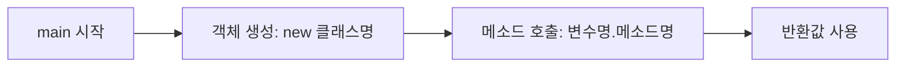

if/switch·for/while/do-while·메소드까지, 프로그램 흐름을 제어하고 코드를 함수 단위로 나누는 법을 배운 학습 노트다.

<!--more-->

## 변수·연산자 다음은 흐름 제어 (Situation)

어제 변수와 연산자로 자바의 기본기를 다졌다면, 오늘은 조건문·반복문·메소드를 순서대로 실습했다.

## 배운 내용 (Task)

목표는 조건에 따라 실행 흐름을 바꾸는 법(if, switch), 같은 코드를 반복하는 법(for, while, do-while), 그리고 반복되는 코드를 메소드로 뽑아내는 법을 직접 코드로 확인하는 것이었다.

## 정리한 내용 (Action)

### if-else — 성적 등급, 나이별 할인율

`if(조건식) {} else if(조건식) {} else {}` 형태로 조건에 따라 분기했다. 점수로 등급을 매기거나, `Scanner`로 입력받은 나이에 따라 할인율을 다르게 적용하는 식이다.

```java
if (age < 13) {
    discountRate = 0.5; // 청소년 50%
} else if (age >= 65) {
    discountRate = 0.3; // 노약자 30%
} else {
    discountRate = 0.0;
}
```

### 단축 평가(short-circuit evaluation) — 조건 순서가 성능이 된다

`&&`는 좌항이 false면 우항을 아예 실행하지 않고, `||`는 좌항이 true면 우항을 실행하지 않는다. 이 성질 때문에 **조건을 어떤 순서로 배치하느냐가 실제 실행 비용에 영향**을 준다는 걸 코드로 확인했다.

| 연산자 | 좌항에 두면 유리한 조건 | 이유 |
|--------|------------------------|------|
| `&&` (AND) | false가 될 확률이 높은 조건 | 좌항이 false면 우항을 평가하지 않고 바로 종료 |
| `\|\|` (OR) | true가 될 확률이 높은 조건 | 좌항이 true면 우항을 평가하지 않고 바로 종료 |

회원가입 예시로 보면, 아이디 중복 검사(1분 소요)와 비밀번호 길이 검사(0.5초 소요)를 `&&`로 묶을 때 실패 확률이 높고 검사 비용이 싼 조건을 좌항에 두면 더 빨리 실패를 알 수 있다.

```java
long start = System.nanoTime();
if (age > 19) { // 자주 발생하는 조건을 좌항에
    discount = "학생 할인 가능";
} else {
    discount = "할인 불가";
}
long end = System.nanoTime();
```

### switch — 다중 분기의 대안

조건이 여러 갈래로 갈릴 때 if-else 체인 대신 `switch`를 썼다. `case`가 일치하는 코드만 실행하고 `break`로 블록을 빠져나오며, `default`가 if의 `else` 역할을 한다.

```java
switch (month) {
    case 1: System.out.println("1월"); break;
    case 2: System.out.println("2월"); break;
    default: System.out.println("그 외의 월입니다.");
}
```

### 반복문 — for, while, do-while

| 반복문 | 특징 | 사용 시점 |
|--------|------|-----------|
| `for` | 초기식·조건식·증감식을 한 줄에 명시 | 반복 횟수가 명확할 때 |
| `while` | 조건식이 true인 동안 반복 | 반복 횟수가 불확실하거나 조건 기반 종료가 필요할 때 |
| `do-while` | 실행 코드를 최소 1회 실행한 뒤 조건 확인 | 무조건 한 번은 실행해야 할 때 |

`for`문 실습에서는 홀수 번째만 출력하고 짝수 번째는 침묵하는 조건(`i % 2 == 1`)을 추가해봤다.

```java
for (int i = 1; i <= 5; i++) {
    if (i % 2 == 1) {
        System.out.println("성원님" + i + "번 했습니다~");
    } else {
        System.out.println("침묵함...");
    }
}
```

### 메소드 — 반복되는 코드를 함수로 묶기

메소드가 없으면 "두 수를 더하고 출력"하는 코드를 매번 새로 작성해야 한다. 메소드로 묶으면 재사용성과 가독성이 올라간다.



```java
public int sumTwoNumber(int a, int b) {
    return a + b;
}
```

호출 관계도 직접 따라가봤다. `main()`이 `methodA()`를 호출하고, `methodA()` 내부에서 `methodB()`를 호출하는 구조에서는 **호출한 쪽에서 명시적으로 부르지 않으면 그 메소드는 절대 실행되지 않는다**는 걸 확인했다. `void`는 반환값이 없는 메소드에 쓴다.

```java
public void methodA() {
    System.out.println("methodA() 호출됨...");
    methodB(); // 여기서 호출해야만 methodB가 실행된다
    System.out.println("methodA() 종료됨...");
}
```

## 결과 (Result)

if/switch로 분기하고, for/while/do-while로 반복하고, 메소드로 코드를 재사용하는 흐름을 한 번에 훑었다. 특히 단축 평가에서 조건 순서가 실행 비용에 영향을 준다는 점과, 메소드는 호출해야만 실행된다는 점이 오늘 가장 인상 깊었던 부분이다.

## 더 학습하면 좋은 개념

- **재귀(Recursion)** — 메소드가 자기 자신을 호출하는 패턴. 오늘 배운 "메소드가 메소드를 호출하는" 구조의 연장선이라 이해하기 쉬운 다음 단계다.
- **메소드 오버로딩(Overloading)** — 같은 이름의 메소드를 매개변수만 다르게 여러 개 정의하는 방법. `sumTwoNumber`처럼 특정 타입에 고정된 메소드를 확장하는 실전 패턴이다.
- **break/continue** — 반복문 중간에 흐름을 제어하는 키워드. for/while 내부에서 특정 조건에 조기 종료하거나 다음 반복으로 건너뛸 때 필요하다.
- **삼항 연산자(Ternary Operator)** — 간단한 if-else를 한 줄로 줄이는 문법. 오늘 짠 할인율 분기처럼 단순한 조건에 적용하면 코드가 짧아진다.

## 참고 자료

- [Oracle 공식 문서 - The if-then and if-then-else Statements](https://docs.oracle.com/javase/tutorial/java/nutsandbolts/if.html)
- [Oracle 공식 문서 - The switch Statement](https://docs.oracle.com/javase/tutorial/java/nutsandbolts/switch.html)
- [Oracle 공식 문서 - The for, while, and do-while Statements](https://docs.oracle.com/javase/tutorial/java/nutsandbolts/for.html)
- [Oracle 공식 문서 - Defining Methods](https://docs.oracle.com/javase/tutorial/java/javaOO/methods.html)
