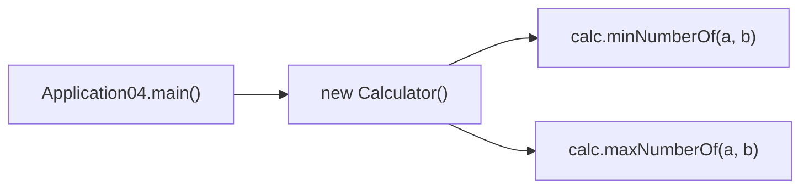

매개변수 종류, 접근제어자, 다른 클래스의 메소드 호출, 삼항 연산자까지 메소드를 더 깊이 다룬 학습 노트다.

<!--more-->

## 메소드를 쓸 줄 안다고 끝이 아니었다 (Situation)

어제는 메소드의 기본 형태와 호출 흐름(`main()` → `methodA()` → `methodB()`)을 배웠다. 오늘은 이어서 메소드의 매개변수·접근제어자·다른 클래스 호출 방식을 더 자세히 봤다.

## 배운 내용 (Task)

목표는 메소드에 여러 타입의 값을 동시에 전달하는 법, 접근제어자의 의미, 그리고 메소드를 모아둔 별도 클래스(`Calculator`)를 만들어서 호출하는 법을 코드로 확인하는 것이었다.

## 정리한 내용 (Action)

### 여러 타입의 전달인자를 받는 메소드

메소드는 매개변수 타입을 여러 개 섞어서 받을 수 있다. 호출할 때 넘기는 값을 "전달인자(argument)", 메소드 선언부에서 받는 값을 "매개변수(parameter)"라고 부른다.

```java
public int testMethod(int a, String s, boolean b, char c) {
    return a;
}

// 호출
int x = app3.testMethod(40, "문자열", true, 'ㅂ');
```

반환 타입이 `void`가 아니면 `return`은 생략할 수 없다는 점도 확인했다. `void` → `int`로 바꾸면서 `return a;`가 왜 필요한지 직접 에러로 겪어봤다.

### 접근제어자 — 누가 이 메소드를 쓸 수 있는가

| 접근제어자 | 접근 가능 범위 |
|------------|----------------|
| `public` | 모든 클래스에서 접근 가능 |
| `protected` | 같은 패키지 또는 자식 클래스에서 접근 가능 |
| (default, 생략) | 같은 패키지 내부에서만 접근 가능 |
| `private` | 같은 클래스 내부에서만 접근 가능 |

### 다른 클래스에 있는 메소드 호출하기

지금까지는 `main()`이 있는 클래스 안의 메소드만 호출했다. 오늘은 사칙연산 메소드를 모아둔 `Calculator` 클래스를 따로 만들고, `Application04`에서 객체를 생성해 호출했다.



```java
Calculator calc = new Calculator();
int min = calc.minNumberOf(first, second);
int max = calc.maxNumberOf(first, second);
```

메소드를 기능별로 별도 클래스에 모아두면, `main()`이 있는 클래스는 "무엇을 할지"에 집중하고 `Calculator`는 "어떻게 계산할지"만 책임지게 된다.

### 삼항 연산자로 메소드 본문 줄이기

어제 "더 학습하면 좋은 개념"에서 다음 단계로 꼽았던 삼항 연산자를 오늘 바로 써봤다. `if-else` 네 줄짜리 분기를 한 줄로 줄일 수 있었다.

```java
public int minNumberOf(int a, int b) {
    return (a > b) ? b : a;
}

public int maxNumberOf(int a, int b) {
    return (a > b) ? a : b;
}
```

`조건식 ? 참일 때 값 : 거짓일 때 값` 형태로, 단순 비교 후 값을 바로 반환할 때는 if-else보다 코드가 짧고 읽기 쉬웠다.

## 결과 (Result)

메소드가 여러 타입의 매개변수를 받을 수 있다는 것, 접근제어자로 호출 가능 범위가 달라진다는 것, 메소드를 기능별 클래스로 분리해서 호출할 수 있다는 것, 그리고 삼항 연산자로 간단한 분기를 줄일 수 있다는 것까지 확인했다. 특히 `Calculator`처럼 기능을 클래스 단위로 분리하니 `main()` 코드가 훨씬 읽기 편해졌다.

## 더 학습하면 좋은 개념

- **메소드 오버로딩(Overloading)** — `minNumberOf`처럼 `int`만 받는 메소드를 `double`, `long` 버전으로도 만들고 싶을 때 필요한 다음 단계 문법이다.
- **접근제어자와 캡슐화(Encapsulation)** — `private`로 필드를 숨기고 `public` 메소드로만 접근하게 하는 설계 원칙. 오늘 배운 접근제어자가 왜 존재하는지 이해하는 열쇠다.
- **클래스 간 협력(Collaboration)** — `Application04`가 `Calculator`에 계산을 위임한 것처럼, 객체지향에서는 한 클래스가 모든 일을 다 하지 않고 역할을 나눈다. 다음으로 배울 객체지향 설계의 기초가 된다.
- **생성자(Constructor)** — `new Calculator()`가 내부적으로 호출하는 특수 메소드. 객체가 생성될 때 초기화 로직을 어떻게 넣는지 알아두면 좋다.

## 참고 자료

- [Oracle 공식 문서 - Defining Methods](https://docs.oracle.com/javase/tutorial/java/javaOO/methods.html)
- [Oracle 공식 문서 - Controlling Access to Members of a Class](https://docs.oracle.com/javase/tutorial/java/javaOO/accesscontrol.html)
- [Oracle 공식 문서 - The Conditional Operator ?:](https://docs.oracle.com/javase/tutorial/java/nutsandbolts/op2.html)
