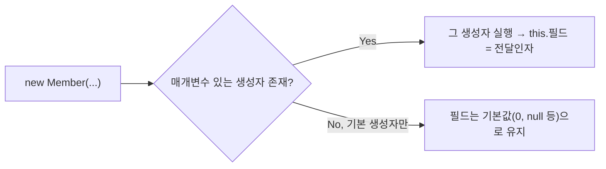

`chap03-object-oriented-programming`을 한 챕터 통째로 배운 날. String 클래스, 배열, 사용자 정의 자료형(클래스), 생성자까지 자바 객체지향의 입구를 정리한 학습 노트다.

<!--more-->

## 메소드 다음은 객체였다 (Situation)

조건문·반복문·메소드까지 배운 뒤, 오늘은 `chap03-object-oriented-programming`을 통째로 진행했다. `a_object` 패키지에서 String과 배열을, `b_oop` 패키지에서 사용자 정의 자료형(클래스)과 생성자를 배웠다.

## 배운 내용 (Task)

목표는 자바의 자료형이 "기본 자료형 → 참조 자료형(String, 배열) → 사용자 정의 자료형(클래스)"으로 확장되는 흐름을 이해하고, 서로 다른 타입의 데이터를 하나의 단위로 묶어서 다루는 방법(클래스, 생성자)을 코드로 확인하는 것이었다.

## 정리한 내용 (Action)

### String — 참조 자료형의 첫 사례

`String`은 `length()`, `charAt(index)`, `trim()` 같은 메소드를 가진 객체다. 가장 헷갈렸던 부분은 **문자열을 만드는 두 가지 방식에 따라 `==` 비교 결과가 달라진다**는 점이었다.

```java
String str1 = "java";          // 리터럴 방식
String str2 = new String("java"); // 객체 생성 방식

System.out.println(str1 == str2);        // false - 메모리 주소가 다름
System.out.println(str1.equals(str2));   // true  - 내용은 같음
```

`new` 키워드는 항상 새로운 메모리 공간을 만들기 때문에, 내용이 같아도 리터럴로 만든 문자열과는 `==` 비교에서 다르다고 나온다. **값(내용) 비교는 `equals()`, 주소 비교는 `==`** 라는 차이를 코드로 확인했다.

### 배열 — 동일한 자료형의 묶음

변수 하나에는 값 하나만 담긴다. 같은 자료형의 값 여러 개를 묶어 다루려면 배열이 필요하다.

```java
int[] iarr = new int[5];        // 선언 + 할당, 기본값 0으로 채워짐
int[] iarr2 = new int[] {1,2,3,4,5,6,7,8,9,10}; // 값과 함께 초기화
```

배열을 `new`로 생성하면 값을 하나도 넣지 않아도 자료형별 기본값(정수 0, 실수 0.0, 논리 false, 참조 null)으로 채워진다는 점이 인상적이었다. heap 메모리에는 빈 값이 존재할 수 없기 때문이라고 한다. 5명의 점수를 입력받아 합계·평균을 구하는 실습에서는 배열과 `for`문을 결합해 `scores[i] = sc.nextInt();`처럼 반복적으로 입력을 채워 넣었다.

### 사용자 정의 자료형 — 서로 다른 타입을 하나로 묶기

회원 정보(아이디, 비밀번호, 이름, 나이, 성별, 취미)처럼 **타입이 제각각인 데이터를 변수 하나로 묶을 방법이 없다**는 게 문제였다. 배열은 "동일한 자료형"만 묶을 수 있기 때문이다. 이걸 해결하는 게 클래스였다.

```java
public class Member {
    String id;
    String pwd;
    String name;
    int age;
    char gender;
    String[] hobby;
}
```

클래스 내부에 메소드 없이 선언한 변수를 필드(= 인스턴스 변수 = 속성)라고 부른다. 객체를 만들고 필드에 접근하는 방식도 확인했다.

```java
Member member = new Member();
member.id = "user02";
member.hobby = new String[]{"야구시청", "배드민턴"};
```

### 생성자 — 객체가 태어나는 순간

`new Member()`를 쓸 때마다 실제로는 **생성자**라는 특수한 메소드가 호출되고 있었다. 매개변수가 없는 생성자를 따로 작성하지 않아도 컴파일러가 기본 생성자를 자동으로 추가해주지만, **매개변수가 있는 생성자를 하나라도 작성하면 기본 생성자는 자동 생성되지 않는다**는 주의사항이 핵심이었다.



```java
public Member(String id, String pwd, String name, int age, char gender, String[] hobby) {
    this.id = id;
    this.pwd = pwd;
    this.name = name;
    this.age = age;
    this.gender = gender;
    this.hobby = hobby;
}
```

`this.id = id;`에서 `this`는 생성되는 객체 자기 자신을 가리킨다. 매개변수명과 필드명이 같을 때, 좌변의 `this.id`는 필드, 우변의 `id`는 매개변수를 의미한다는 걸 구분해서 이해했다.

마지막으로 `toString()`을 오버라이드해서 `System.out.println(member)`로 출력했을 때 `Member@1b6d3586` 같은 주소값 대신 필드 내용이 보이도록 바꿔봤다.

```java
@Override
public String toString() {
    return "Member{id='" + id + "', name='" + name + "', age=" + age + "}";
}
```

## 결과 (Result)

String의 `==`/`equals()` 차이, 배열의 기본값 채움, 클래스로 서로 다른 타입을 묶는 방법, 생성자와 `this`까지 한 챕터를 이어서 훑었다. 특히 어제 메소드에서 배운 "접근제어자"와 "매개변수"가 생성자에도 그대로 적용된다는 걸 느꼈고, `new`가 단순 메모리 할당이 아니라 생성자 호출이라는 걸 명확히 이해한 게 오늘 가장 큰 수확이었다.

## 더 학습하면 좋은 개념

- **캡슐화(Encapsulation)와 getter/setter** — 오늘은 필드에 `member.id = "..."`처럼 직접 접근했는데, 실무에서는 `private` 필드 + getter/setter로 감싸는 게 일반적이다. 왜 직접 접근을 막는지 이어서 배우면 좋다.
- **생성자 오버로딩(Constructor Overloading)** — `Member()`와 `Member(id, pwd, ...)`처럼 매개변수 개수가 다른 생성자를 여러 개 정의하는 방법. 오늘 "기본 생성자가 사라진다"는 문제를 해결하는 실전 패턴이다.
- **ArrayList와 컬렉션 프레임워크** — 오늘 배운 배열은 크기가 고정된다는 한계가 있다. 가변 크기 컬렉션인 `ArrayList`를 다음 단계로 배우면 실무에서 더 자주 쓰게 된다.
- **equals()와 hashCode() 오버라이드** — 오늘은 String의 `equals()`만 썼는데, 사용자 정의 클래스(`Member`)도 `equals()`를 오버라이드하지 않으면 주소 비교만 하게 된다. 객체 비교 원리를 더 깊이 이해하는 다음 단계다.

## 참고 자료

- [Oracle 공식 문서 - The String Class](https://docs.oracle.com/javase/tutorial/java/data/strings.html)
- [Oracle 공식 문서 - Arrays](https://docs.oracle.com/javase/tutorial/java/nutsandbolts/arrays.html)
- [Oracle 공식 문서 - Classes](https://docs.oracle.com/javase/tutorial/java/javaOO/classes.html)
- [Oracle 공식 문서 - Using the this Keyword](https://docs.oracle.com/javase/tutorial/java/javaOO/thiskey.html)
