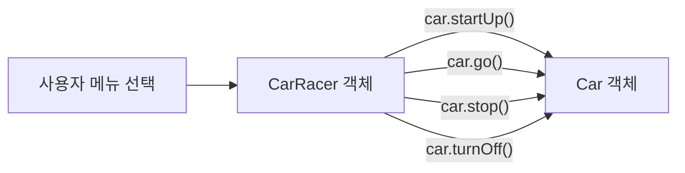

병결로 수업을 못 들은 날, 캡슐화와 추상화 실습 코드를 혼자 읽고 따라 실행하며 공부한 기록이다.

<!--more-->

## 수업은 못 들었지만 코드는 남아있었다 (Situation)

이날은 몸이 안 좋아 병결을 했다. 수업을 직접 듣지는 못했지만, 캡슐화와 추상화 실습 코드가 저장소에 올라와 있어서 문제 상황부터 해결까지 단계별로 짜여있는 코드를 혼자 읽으면서 따라가봤다.

## 공부한 내용 (Task)

목표는 "왜 필드에 직접 접근하면 안 되는가"(캡슐화)와 "복잡한 현실을 어떻게 객체로 단순화하는가"(추상화)를 코드의 문제-해결 흐름을 따라가며 이해하는 것이었다.

## 공부 과정 (Action)

### 캡슐화 — 문제 1: 검증되지 않은 값이 그대로 들어간다

첫 번째 예제는 필드에 직접 접근할 수 있을 때 생기는 문제를 보여준다. `hp`에 음수를 그냥 대입하면 체력이 음수인 몬스터가 생긴다.

```java
Monster monster2 = new Monster();
monster2.name = "피카츄";
monster2.hp = -200; // 검증 없이 그대로 들어감
```

같은 파일에 `setHp(int hp)`라는 메소드도 있어서, 음수면 0으로 강제하는 검증 로직이 이미 존재한다는 걸 봤다. 문제는 **메소드를 거치지 않고 필드에 직접 접근하는 경로가 여전히 열려있다**는 점이었다.

### 캡슐화 — 문제 2: 필드명이 바뀌면 사방이 깨진다

`problem2`에서는 `name` 필드를 `kinds`로 바꾸자, 그 필드를 직접 참조하던 `Application` 쪽 코드가 전부 컴파일 에러를 일으켰다. 필드에 외부에서 직접 접근하는 구조에서는 **필드명 하나를 바꿔도 사용하는 모든 곳을 찾아다니며 고쳐야 한다**는 걸 확인했다.

### 캡슐화 — 문제 3: 메소드로 접근해도 필드는 여전히 열려있다

`problem3`에서는 `setName()`, `getInfo()` 같은 메소드로 접근하도록 바꿔서 문제 1, 2는 해결됐다. 하지만 마지막에 이런 코드가 여전히 동작했다.

```java
monster3.hp = -5500; // 메소드를 거치지 않고 필드에 또 직접 접근 가능
```

메소드를 만들어도 필드 자체가 `public`이면 **누구든 검증 로직을 건너뛰고 필드를 망가뜨릴 수 있다**는 게 마지막 구멍이었다.

### 캡슐화 — 해결: private으로 필드를 잠그기

`problem_solved`에서 필드에 `private`을 붙이자 외부에서 필드 접근 자체가 컴파일 에러로 막혔다. `setHp()`, `setName()`, `getInfo()` 같은 공개 메소드로만 값을 주고받을 수 있게 된 것이다.

```java
private String kinds;
private int hp;

public void setHp(int hp) {
    if (hp >= 0) {
        this.hp = hp;
    } else {
        this.hp = 0; // 검증을 우회할 방법이 없다
    }
}
```

| 단계 | 문제 | 원인 |
|------|------|------|
| problem1 | 검증 안 된 값이 그대로 들어감 | 필드 직접 접근 |
| problem2 | 필드명 변경 시 사방이 깨짐 | 필드 직접 참조 |
| problem3 | 메소드가 있어도 필드는 여전히 열려있음 | 필드가 `public` |
| problem_solved | 필드 보호 + 검증 로직 강제 | 필드를 `private`으로 잠금 |

### 추상화 — 복잡한 현실을 메시지로 단순화하기

`d_abstraction`의 주제는 "카레이서가 자동차를 운전하는 프로그램"이었다. 주석에 적힌 설계 힌트가 인상적이었다. **"은/는, 이/가" 앞에 오는 단어가 대부분 클래스 후보**라는 것. 요구사항 문장에서 "카레이서는", "자동차가"를 뽑아내면 그게 곧 `CarRacer`, `Car` 클래스가 된다.



`Car`는 속력(`speed`)과 시동 여부(`isOn`)라는 상태만 가지고, 현실의 수많은 자동차 속성(색상, 연비, 브랜드 등) 중 이 프로그램 목적에 필요한 것만 남겼다. 이게 추상화라는 걸 코드로 이해했다.

```java
public void go() {
    if (isOn) {
        this.speed += 10;
    } else {
        System.out.println("차의 시동이 걸려있지 않습니다.");
    }
}
```

`CarRacer`는 `Car`를 필드로 들고, `Application`은 `CarRacer`하고만 소통한다. `Application`이 `Car`를 직접 건드리지 못하게 막은 구조도 결국 캡슐화의 연장선이라는 걸 느꼈다.

```java
public class CarRacer {
    private Car car = new Car(); // Application은 Car에 직접 접근할 수 없다
    public void stratUp() { car.startUp(); }
}
```

## 결과 (Result)

수업을 직접 듣지는 못했지만, `problem1 → problem_solved`로 이어지는 코드 흐름 덕분에 "왜 캡슐화가 필요한가"를 문제 상황별로 순서대로 이해할 수 있었다. 추상화 코드에서는 "은/는, 이/가" 앞 단어가 클래스 후보라는 설계 팁을 얻은 게 가장 실용적이었다. 다음 수업 시간에 선생님 설명과 비교해서 빠진 부분이 있는지 다시 확인해볼 생각이다.

## 더 학습하면 좋은 개념

- **getter/setter 네이밍 컨벤션** — 오늘 본 `setHp`, `setName`, `getInfo`는 자바에서 흔히 쓰는 관례다. `get`/`set` 접두사와 `getInfo`처럼 복합 정보를 반환하는 메소드의 차이를 더 정리해두면 좋다.
- **상태 패턴(State Pattern)** — `Car`의 `isOn`, `speed`에 따라 동작이 달라지는 구조는 상태 패턴의 아주 단순한 형태다. 상태 종류가 늘어날 때 if문이 아니라 어떻게 설계하는지 다음 단계로 배울 만하다.
- **상속(Inheritance)** — 오늘은 `CarRacer`가 `Car`를 필드로 "가지는" 관계(has-a)만 봤는데, 다음으로 "~이다"(is-a) 관계인 상속을 배우면 객체지향 4대 특성(캡슐화·추상화·상속·다형성)이 완성된다.
- **인터페이스(Interface)와 추상 클래스** — 자바에서 "추상화"를 문법 차원에서 지원하는 장치다. 오늘 배운 개념적 추상화가 코드 문법으로는 어떻게 구현되는지 이어서 보면 좋다.

## 참고 자료

- [Oracle 공식 문서 - Controlling Access to Members of a Class](https://docs.oracle.com/javase/tutorial/java/javaOO/accesscontrol.html)
- [Oracle 공식 문서 - What Is an Object?](https://docs.oracle.com/javase/tutorial/java/concepts/object.html)
