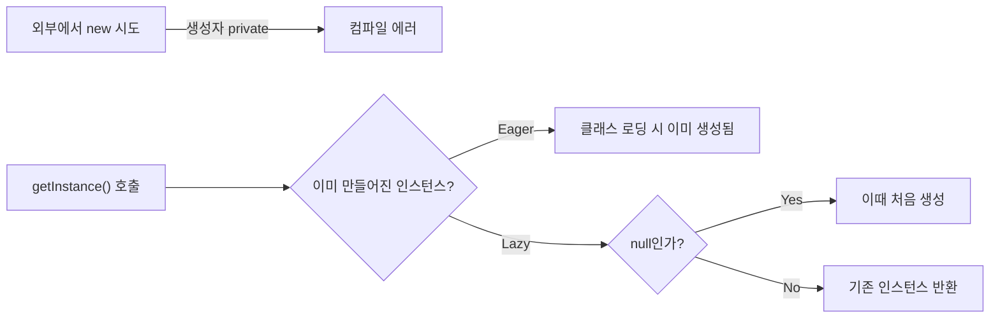
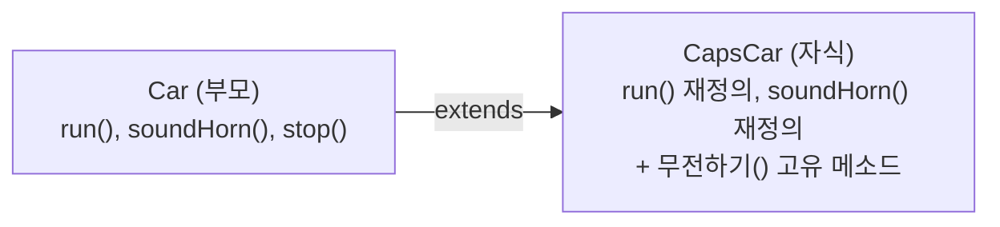

메소드 오버로딩, static·싱글톤·final 키워드부터 상속과 다형성, 인터페이스까지 객체지향을 완결 짓는 학습 노트다.

<!--more-->

## 캡슐화·추상화 다음은 키워드와 상속·다형성이었다 (Situation)

지난번 결석으로 혼자 공부했던 캡슐화·추상화에 이어, 오늘은 메소드 오버로딩과 static·싱글톤·final 키워드, 그리고 상속과 다형성, 인터페이스까지 수업으로 배웠다. 객체지향 4대 특성(캡슐화·추상화·상속·다형성)을 완결 짓는 하루였다.

## 배운 내용 (Task)

목표는 메소드를 같은 이름으로 여러 개 정의하는 오버로딩, 클래스 전체가 공유하는 `static`과 이를 응용한 싱글톤 패턴, 값을 한 번만 정할 수 있게 하는 `final`을 확인하고, 이어서 부모의 기능을 물려받는 상속(extends), 하나의 타입으로 여러 객체를 다르게 동작시키는 다형성, 구현을 강제하는 인터페이스까지 코드로 확인하는 것이었다.

## 정리한 내용 (Action)

### 오버로딩 — 메소드 시그니처가 같으면 안 된다

메소드를 식별하는 고유값을 **시그니처**라고 부르는데, "메소드명 + 매개변수 목록"이 시그니처를 구성한다. **매개변수의 개수나 타입, 순서가 다르면** 같은 이름으로 여러 메소드를 정의할 수 있다.

```java
public void test() {}
public void test(int num) {}                // 매개변수 개수로 구분
public void test(int num, String str) {}    // 개수로 구분
public void test(String str, int num) {}    // 순서로 구분
```

반면 **접근제어자, 반환타입, 매개변수명은 시그니처에 영향을 주지 않는다**는 점이 실습에서 확인한 핵심이었다. `public void test() {}`와 `private int test() { return 0; }`은 매개변수가 똑같이 없기 때문에 시그니처가 같아 에러가 난다.

| 바꾼 것 | 오버로딩 성립 여부 | 이유 |
|---------|---------------------|------|
| 매개변수 개수 | 성립 | 시그니처에 포함됨 |
| 매개변수 타입/순서 | 성립 | 시그니처에 포함됨 |
| 매개변수명 | 불성립 | 시그니처에 영향 없음 |
| 접근제어자 | 불성립 | 시그니처에 영향 없음 |
| 반환타입만 | 불성립 | 시그니처에 영향 없음 |

### static — 객체마다 따로 갖지 않고 클래스가 공유하는 값

`static`이 붙은 변수는 객체(인스턴스) 생성 시점이 아니라 **애플리케이션 시작 시점에 딱 한 번 초기화**되고, 모든 인스턴스가 공유한다.

```java
private int nonStaticInt;        // 인스턴스마다 따로 존재
private static int staticInt;    // 모든 인스턴스가 공유
```

직접 두 개의 객체(`st1`, `st2`)를 만들어서 확인해보니, `nonStaticInt`는 객체별로 독립적으로 증가했지만 `staticInt`는 어떤 객체에서 증가시키든 하나의 값으로 계속 누적됐다. `static` 메소드는 `클래스명.메소드명()`으로 호출한다는 것도 확인했다(`StaticFieldTest.getStaticInt()`).

### 싱글톤 — static으로 인스턴스를 하나로 제한하기

싱글톤은 "애플리케이션 전체에서 인스턴스를 단 하나만 쓰겠다"는 디자인 패턴이다. 리모컨처럼 여러 개 만들 필요가 없는 객체에 쓴다. 핵심은 **기본 생성자를 `private`으로 막아서 외부에서 `new`로 만들지 못하게 하고**, `static` 메소드로만 인스턴스를 꺼내 쓰게 하는 것이다.



| 방식 | 생성 시점 | 특징 |
|------|-----------|------|
| Eager(이른 초기화) | 필드 선언과 동시에 미리 생성 | 구현이 단순하지만 안 쓰여도 메모리를 먼저 차지 |
| Lazy(게으른 초기화) | `getInstance()`가 처음 호출될 때 생성 | 필요할 때만 생성되지만 `null` 체크 로직이 필요 |

```java
// Eager
private static EagerSingleton eager = new EagerSingleton();
private EagerSingleton() {}
public static EagerSingleton getInstance() { return eager; }

// Lazy
private static LazySingleton lazy;
private LazySingleton() {}
public static LazySingleton getInstance() {
    if (lazy == null) {
        lazy = new LazySingleton();
    }
    return lazy;
}
```

`eager1.hashCode()`와 `eager2.hashCode()`를 출력해서 두 변수가 실제로 같은 해시코드, 즉 같은 인스턴스를 가리킨다는 걸 눈으로 확인했다.

### final — 한 번 정하면 못 바꾼다

`final`이 붙은 필드는 값을 한 번 초기화하면 이후 변경이 불가능하다. 여기서 중요한 규칙은 **반드시 "선언과 동시에" 또는 "생성자 안에서" 초기화해야 한다**는 것이다. 선언만 해두고 초기화를 생략하면 컴파일 에러가 난다.

```java
private final int NON_STATIC_NUM = 1;     // 선언과 동시에 초기화
private final int NON_STATIC_NUM2;        // 선언만

public FinalFieldTest(int num) {
    this.NON_STATIC_NUM2 = num;           // 생성자에서 초기화
}
```

값을 바꾸는 setter를 만들려고 하면 "final 필드에는 값을 대입할 수 없다"는 에러가 나서, `final`이 정말로 재대입을 막는다는 걸 직접 겪어봤다.

### 상속(extends) — 부모의 필드·메소드를 물려받기

"부모의 돈(필드, 메소드)은 내 돈이고, 내 돈은 내 돈이다." 현실세계의 상속 개념 그대로, `extends`를 쓰면 자식 클래스가 부모의 필드와 메소드를 물려받는다. 경찰차(`CapsCar`)는 차(`Car`)의 자식이다 — "경찰차는 차다"라는 **IS-A 관계**가 성립하기 때문이다.

```java
public class Car {
    public void run() {
        System.out.println("자동차가 달려갑니다~~~~~~");
    }
}

public class CapsCar extends Car {
    @Override
    public void run() {
        System.out.println("경찰차는 삐용삐용~~하면서 달립니다!!");
    }

    public void 무전하기() {
        System.out.println("치지지ㅣ...412호에 ~ 등장");
    }
}
```

상속으로 얻는 이점은 명확했다. **반복되는 메소드는 부모 클래스에 한 번만 정의**하고, 자식 클래스는 상속만 받되, **다르게 동작해야 하는 메소드만 `Override`로 재정의**한다. `CapsCar`는 `run()`, `soundHorn()`은 재정의하면서도 `무전하기()`처럼 본인만의 고유 메소드도 추가로 가질 수 있었다.



`this`와 `super`의 차이도 짚었다. `this`는 자기 자신의 인스턴스 주소, `super`는 부모의 인스턴스 주소를 가리킨다. `super.run()`을 호출하면 자식에서 재정의하기 전, 부모의 원래 동작을 그대로 실행할 수 있다.

### 다형성 — 하나의 타입으로 여러 객체를 다루기

다형성은 **하나의 인스턴스가 여러 타입을 가질 수 있는 것**을 의미한다. 덕분에 하나의 타입으로 여러 타입의 인스턴스를 처리하고, 같은 메소드 호출로도 객체마다 다르게 동작하게 만들 수 있다.

```java
Animal a1 = new Raccoon(); // Animal 타입 변수에 Raccoon 인스턴스를 담는다
```

여기서도 **IS-A 관계**가 기준이 됐다. "너구리는 동물이다"(O)이므로 `Animal a1 = new Raccoon();`은 성립하지만, "동물은 너구리다"(X)이므로 반대 방향(`Raccoon r1 = new Animal();`)은 성립하지 않는다. 담을 수 있는 공간의 크기로 비유하면 `Animal`이 `Raccoon`보다 큰 공간이라, 큰 공간에 작은 값은 들어가도 그 반대는 안 되는 셈이다.

**동적 바인딩**도 확인했다. 컴파일 시점에는 `Animal` 타입의 메소드와 연결되어 있다가, 런타임 시점에 실제 인스턴스(`Raccoon`)가 가진 오버라이딩된 메소드로 바뀌어 동작한다.

```java
Animal a1 = new Raccoon();
a1.bark(); // "너굴너굴 너굴맨.." - Raccoon의 재정의된 메소드가 실행된다

// a1.bite(); // 컴파일 에러 - Animal 타입에는 bite()가 없음
((Raccoon) a1).bite(); // 클래스 형변환 후에는 호출 가능
```

`a1`은 컴파일 시점에 `Animal` 타입이기 때문에, `Raccoon`만의 고유 기능(`bite()`)은 바로 쓸 수 없고 클래스 형변환이 필요했다.

### 인터페이스 — "Can-Do"를 강제하기

인터페이스는 **그 인터페이스를 구현하는 클래스가 반드시 구현해야 하는 메소드를 강제**한다. "Can-Do"라는 표현이 와닿았다 — "이걸 할 수 있어야 한다"는 계약서 같은 역할이다.

```java
public interface Animal {
    void run();
    void eat();
    void bark();
}

public class Raccoon implements Animal {
    @Override
    public void run() { System.out.println("너구리가 폴짝폴짝 뛰어다닙니다.."); }
    @Override
    public void eat() {}
    @Override
    public void bark() {}
}
```

인터페이스는 생성자를 가질 수 없고, 기본적으로 구현부가 있는 메소드도 쓸 수 없다. 그래서 `new Animal()`처럼 인터페이스 자체의 객체는 만들 수 없고, 반드시 구현 클래스를 통해서만 객체를 만들 수 있다. 또한 클래스 상속은 `extends`를 쓰지만, **인터페이스는 `implements`로 구현한다**는 키워드 차이도 확인했다.

```java
Animal animal = new Raccoon(); // 인터페이스 타입 변수에 구현체를 담는 것도 다형성이다
```

| 구분 | 상속(extends) | 인터페이스(implements) |
|------|----------------|-------------------------|
| 키워드 | `extends` | `implements` |
| 목적 | 부모의 필드·메소드 재사용 | 구현을 강제(계약) |
| 생성자 | 가질 수 있음 | 가질 수 없음 |
| 다중 연결 | 자바는 클래스 다중상속 불가 | 여러 인터페이스 동시 구현 가능 |

## 결과 (Result)

메소드 시그니처라는 기준으로 오버로딩의 성립 조건을 명확히 구분할 수 있게 됐고, `static`이 인스턴스가 아닌 클래스 레벨에서 공유된다는 걸 두 개의 객체를 직접 만들어 비교하며 확인했다. 그 `static`이 싱글톤 패턴(생성자 `private` + `static` 인스턴스)으로 이어지는 흐름도 자연스럽게 연결됐고, `final`은 "불변"을 코드 레벨에서 강제하는 방법을 보여줬다. 이어서 상속으로 반복 코드를 부모에 몰아주고 다르게 동작할 부분만 `Override`하는 흐름, 다형성으로 하나의 타입이 여러 인스턴스를 담당하면서 런타임에 실제 타입의 메소드가 실행되는 동적 바인딩, 인터페이스로 구현을 강제하는 설계까지 — 캡슐화·추상화·상속·다형성 네 가지가 서로 독립된 게 아니라 하나로 이어진다는 걸 느낀 하루였다.

## 더 학습하면 좋은 개념

- **static 초기화 블록(static {})** — 오늘 배운 `static` 필드를 복잡한 로직으로 초기화해야 할 때 쓰는 문법. 싱글톤의 Eager 방식과 맞닿아 있다.
- **멀티스레드 환경에서의 싱글톤** — 오늘 본 Lazy 싱글톤은 `if (lazy == null)` 체크가 여러 스레드에서 동시에 실행되면 인스턴스가 두 개 생길 수 있다. `synchronized`나 더블 체크 락킹으로 어떻게 막는지 다음 단계로 알아둘 만하다.
- **추상 클래스(Abstract Class)** — 인터페이스처럼 구현을 강제하면서도 일부 메소드는 구현부를 가질 수 있는 중간 형태다. 오늘 배운 인터페이스와의 차이를 비교해보면 좋다.
- **instanceof 연산자** — 오늘 `((Raccoon) a1).bite()`처럼 강제 형변환을 했는데, 형변환 전에 실제 타입을 안전하게 확인하는 연산자다. `ClassCastException`을 예방하는 다음 단계다.
- **enum을 이용한 싱글톤 구현** — 디자인 패턴 책에서 "가장 안전한 싱글톤 구현법"으로 꼽히는 방식이다. 오늘 배운 private 생성자 방식과 비교해보면 좋다.

## 참고 자료

- [Oracle 공식 문서 - Defining Methods (Overloading)](https://docs.oracle.com/javase/tutorial/java/javaOO/methods.html)
- [Oracle 공식 문서 - Understanding Class Members (static)](https://docs.oracle.com/javase/tutorial/java/javaOO/classvars.html)
- [Oracle 공식 문서 - Variables (final)](https://docs.oracle.com/javase/tutorial/java/javaOO/variables.html)
- [Oracle 공식 문서 - Inheritance](https://docs.oracle.com/javase/tutorial/java/IandI/subclasses.html)
- [Oracle 공식 문서 - Polymorphism](https://docs.oracle.com/javase/tutorial/java/IandI/polymorphism.html)
- [Oracle 공식 문서 - Interfaces](https://docs.oracle.com/javase/tutorial/java/IandI/createinterface.html)
