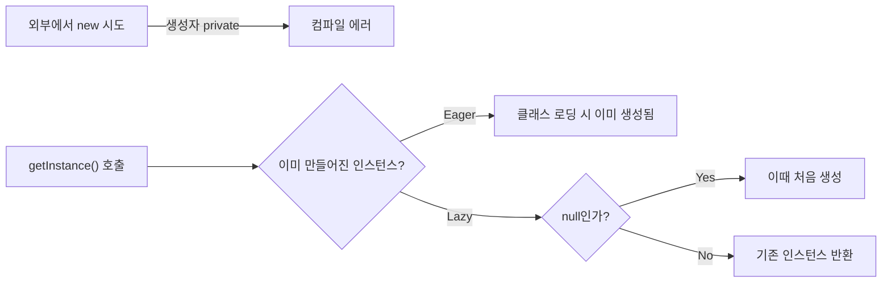

메소드 오버로딩부터 static·싱글톤·final 키워드까지 배운 학습 노트다.

<!--more-->

## 캡슐화·추상화 다음은 키워드였다 (Situation)

지난번 결석으로 혼자 공부했던 캡슐화·추상화에 이어, 오늘은 메소드 오버로딩과 static·싱글톤·final 키워드를 수업으로 배웠다.

## 배운 내용 (Task)

목표는 메소드를 같은 이름으로 여러 개 정의하는 오버로딩, 객체마다 따로 갖지 않고 클래스 전체가 공유하는 `static`, `static`을 응용한 싱글톤 패턴, 그리고 값을 한 번만 정할 수 있게 하는 `final`까지 네 가지 키워드/패턴을 코드로 확인하는 것이었다.

## 정리한 내용 (Action)

### 오버로딩 — 메소드 시그니처가 같으면 안 된다

메소드를 식별하는 고유값을 **시그니처**라고 부르는데, "메소드명 + 매개변수 목록"이 시그니처를 구성한다. **매개변수의 개수나 타입, 순서가 다르면** 같은 이름으로 여러 메소드를 정의할 수 있다.

```java
public void test() {}
public void test(int num) {}                // 매개변수 개수로 구분
public void test(int num, String str) {}    // 개수로 구분
public void test(String str, int num) {}    // 순서로 구분
```

반면 **접근제어자, 반환타입, 매개변수명은 시그니처에 영향을 주지 않는다**는 점이 실습에서 확인한 핵심이었다. `public void test() {}`와 `private int test() { return 0; }`은 매개변수가 똑같이 없기 때문에 시그니처가 같아 에러가 난다.

| 바꾼 것 | 오버로딩 성립 여부 | 이유 |
|---------|---------------------|------|
| 매개변수 개수 | 성립 | 시그니처에 포함됨 |
| 매개변수 타입/순서 | 성립 | 시그니처에 포함됨 |
| 매개변수명 | 불성립 | 시그니처에 영향 없음 |
| 접근제어자 | 불성립 | 시그니처에 영향 없음 |
| 반환타입만 | 불성립 | 시그니처에 영향 없음 |

### static — 객체마다 따로 갖지 않고 클래스가 공유하는 값

`static`이 붙은 변수는 객체(인스턴스) 생성 시점이 아니라 **애플리케이션 시작 시점에 딱 한 번 초기화**되고, 모든 인스턴스가 공유한다.

```java
private int nonStaticInt;        // 인스턴스마다 따로 존재
private static int staticInt;    // 모든 인스턴스가 공유
```

직접 두 개의 객체(`st1`, `st2`)를 만들어서 확인해보니, `nonStaticInt`는 객체별로 독립적으로 증가했지만 `staticInt`는 어떤 객체에서 증가시키든 하나의 값으로 계속 누적됐다. `static` 메소드는 `클래스명.메소드명()`으로 호출한다는 것도 확인했다(`StaticFieldTest.getStaticInt()`).

### 싱글톤 — static으로 인스턴스를 하나로 제한하기

싱글톤은 "애플리케이션 전체에서 인스턴스를 단 하나만 쓰겠다"는 디자인 패턴이다. 리모컨처럼 여러 개 만들 필요가 없는 객체에 쓴다. 핵심은 **기본 생성자를 `private`으로 막아서 외부에서 `new`로 만들지 못하게 하고**, `static` 메소드로만 인스턴스를 꺼내 쓰게 하는 것이다.



| 방식 | 생성 시점 | 특징 |
|------|-----------|------|
| Eager(이른 초기화) | 필드 선언과 동시에 미리 생성 | 구현이 단순하지만 안 쓰여도 메모리를 먼저 차지 |
| Lazy(게으른 초기화) | `getInstance()`가 처음 호출될 때 생성 | 필요할 때만 생성되지만 `null` 체크 로직이 필요 |

```java
// Eager
private static EagerSingleton eager = new EagerSingleton();
private EagerSingleton() {}
public static EagerSingleton getInstance() { return eager; }

// Lazy
private static LazySingleton lazy;
private LazySingleton() {}
public static LazySingleton getInstance() {
    if (lazy == null) {
        lazy = new LazySingleton();
    }
    return lazy;
}
```

`eager1.hashCode()`와 `eager2.hashCode()`를 출력해서 두 변수가 실제로 같은 해시코드, 즉 같은 인스턴스를 가리킨다는 걸 눈으로 확인했다.

### final — 한 번 정하면 못 바꾼다

`final`이 붙은 필드는 값을 한 번 초기화하면 이후 변경이 불가능하다. 여기서 중요한 규칙은 **반드시 "선언과 동시에" 또는 "생성자 안에서" 초기화해야 한다**는 것이다. 선언만 해두고 초기화를 생략하면 컴파일 에러가 난다.

```java
private final int NON_STATIC_NUM = 1;     // 선언과 동시에 초기화
private final int NON_STATIC_NUM2;        // 선언만

public FinalFieldTest(int num) {
    this.NON_STATIC_NUM2 = num;           // 생성자에서 초기화
}
```

값을 바꾸는 setter를 만들려고 하면 "final 필드에는 값을 대입할 수 없다"는 에러가 나서, `final`이 정말로 재대입을 막는다는 걸 직접 겪어봤다.

## 결과 (Result)

메소드 시그니처라는 기준으로 오버로딩의 성립 조건을 명확히 구분할 수 있게 됐고, `static`이 인스턴스가 아닌 클래스 레벨에서 공유된다는 걸 두 개의 객체를 직접 만들어 비교하며 확인했다. 그 `static`이 싱글톤 패턴(생성자 `private` + `static` 인스턴스)으로 이어지는 흐름도 자연스럽게 연결됐다. `final`은 "불변"이라는 개념을 코드 레벨에서 어떻게 강제하는지 보여준 키워드였다.

## 더 학습하면 좋은 개념

- **static 초기화 블록(static {})** — 오늘 배운 `static` 필드를 복잡한 로직으로 초기화해야 할 때 쓰는 문법. 싱글톤의 Eager 방식과 맞닿아 있다.
- **멀티스레드 환경에서의 싱글톤** — 오늘 본 Lazy 싱글톤은 `if (lazy == null)` 체크가 여러 스레드에서 동시에 실행되면 인스턴스가 두 개 생길 수 있다. `synchronized`나 더블 체크 락킹으로 어떻게 막는지 다음 단계로 알아둘 만하다.
- **불변 객체(Immutable Object)** — `final` 필드로만 구성된 클래스는 생성 후 상태가 절대 바뀌지 않는다. 자바의 `String`이 대표적인 불변 객체인데, 오늘 배운 `final`이 그 밑바탕이 된다.
- **enum을 이용한 싱글톤 구현** — 디자인 패턴 책에서 "가장 안전한 싱글톤 구현법"으로 꼽히는 방식이다. 오늘 배운 private 생성자 방식과 비교해보면 좋다.

## 참고 자료

- [Oracle 공식 문서 - Defining Methods (Overloading)](https://docs.oracle.com/javase/tutorial/java/javaOO/methods.html)
- [Oracle 공식 문서 - Understanding Class Members (static)](https://docs.oracle.com/javase/tutorial/java/javaOO/classvars.html)
- [Oracle 공식 문서 - Variables (final)](https://docs.oracle.com/javase/tutorial/java/javaOO/variables.html)
