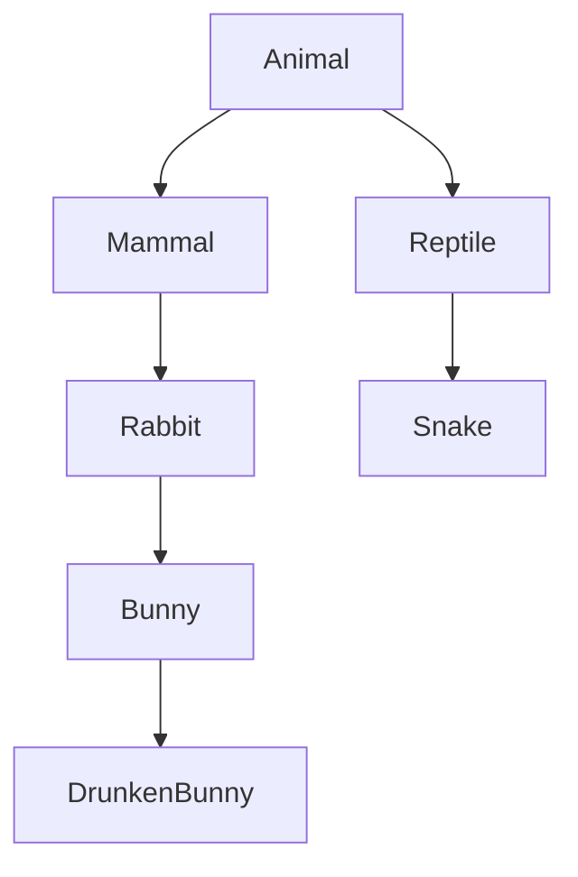

제네릭 기본 문법부터 바운디드 타입·와일드카드, List·Set 컬렉션까지 정리한 학습 노트다.

<!--more-->

## 배열의 한계를 넘어서는 챕터 (Situation)

오늘은 제네릭 기본 문법과 바운디드 타입·와일드카드를 배우고, 이어서 List와 Set 컬렉션까지 실습했다.

## 배운 내용 (Task)

목표는 제네릭으로 타입을 컴파일 시점에 안전하게 고정하는 방법, 상속 관계에서 제네릭 타입을 제한하는 법(바운디드 타입·와일드카드), 그리고 배열의 "크기 고정" 한계를 극복하는 컬렉션(List, Set)의 특징을 코드로 확인하는 것이었다.

## 정리한 내용 (Action)

### 제네릭 — 타입을 나중에 결정하되, 안전하게

제네릭이 없으면 `Object` 타입으로 아무 값이나 담을 수 있지만, 꺼내 쓸 때 타입을 다시 확인해야 한다. `<T>`로 타입을 지정하면 **컴파일 시점에 타입 검사**가 된다.

```java
public class GenericTest<T> {
    private T value;
    public T getValue() { return value; }
    public void setValue(T value) { this.value = value; }
}

GenericTest<String> gt2 = new GenericTest<>();
gt2.setValue("문자열");
// gt2.setValue(1); // 컴파일 에러 - String만 허용
```

다이아몬드 연산자(`<>`) 안에는 기본 자료형을 못 쓴다는 것도 확인했다. `int`는 안 되고 `Integer`처럼 기본 자료형을 객체로 감싼 **래퍼(Wrapper) 클래스**를 써야 한다.

| 기본 자료형 | 래퍼 클래스 |
|-------------|-------------|
| `int` | `Integer` |
| `byte` | `Byte` |
| `short` | `Short` |
| `boolean` | `Boolean` |
| `char` | `Character` |

### 바운디드 타입 — 제네릭에 상속 제한 걸기

토끼 농장(`RabbitFarm<T>`)을 만들면서, 아무 타입이나 들어올 수 있으면 포유류·파충류·뱀까지 다 들어올 수 있다는 문제를 봤다. `T extends Rabbit`으로 **Rabbit 또는 그 자손만** 들어오게 제한했다.



```java
public class RabbitFarm<T extends Rabbit> {
    private T animal;
}

RabbitFarm<Rabbit> farm1 = new RabbitFarm<>();
RabbitFarm<Bunny> farm2 = new RabbitFarm<>();
// RabbitFarm<Mammal> farm = new RabbitFarm<>(); // 에러 - Rabbit의 자손이 아님
```

여기서 중요한 포인트는 `RabbitFarm<Bunny>`에는 `Rabbit`도 못 들어간다는 것이었다. `Bunny`로 타입을 고정한 농장에는 **정확히 Bunny이거나 그 자손만** 넣을 수 있고, 부모인 `Rabbit`은 들어갈 수 없다.

### 와일드카드 — 메소드 매개변수에서 타입을 유연하게 받기

`RabbitFarm<Rabbit>`, `RabbitFarm<Bunny>`, `RabbitFarm<DrunkenBunny>`를 전부 하나의 메소드로 받고 싶을 때 와일드카드(`?`)를 썼다.

| 와일드카드 | 의미 | 예시 |
|------------|------|------|
| `<?>` | 제한 없음, 아무 타입이나 | `RabbitFarm<?>` |
| `<? extends Type>` | 상한 제한 — Type이거나 그 자손만 | `RabbitFarm<? extends Bunny>` |
| `<? super Type>` | 하한 제한 — Type이거나 그 부모만 | `RabbitFarm<? super Bunny>` |

```java
public void extendsType(RabbitFarm<? extends Bunny> farm) {
    farm.getAnimal().cry();
}
// extendsType(new RabbitFarm<Rabbit>(...)); // 에러 - Rabbit은 Bunny의 부모라 상한 제한 위반
```

`extends`는 "자식 쪽으로 제한", `super`는 "부모 쪽으로 제한"이라는 방향을 코드로 직접 틀려보면서 확인했다.

### List — 순서 있고 중복 허용하는 컬렉션

배열은 크기가 고정이라 한 번 만들면 늘리거나 줄일 수 없다는 단점이 있다. `List`(구현체 `ArrayList`)는 크기가 가변이고, 순서를 유지하면서 중복도 허용한다.

```java
List<String> strings = new ArrayList<>();
strings.add("a");
strings.add("c");
strings.add("b");
Collections.sort(strings); // [a, b, c]
```

책 정보를 담는 `BookDTO`(DTO: 데이터 운반만 담당하는 클래스 — 필드, 생성자, getter/setter, toString으로만 구성)를 만들어 `List<BookDTO>`에 담고, 일반 `for`문과 향상된 `for`문(`for (BookDTO book : bookList)`) 두 가지로 순회해봤다.

### Set — 순서 없고 중복 안 되는 컬렉션

`Set`(구현체 `HashSet`)은 저장 순서를 유지하지 않고, 같은 값을 두 번 넣어도 하나만 남는다.

```java
Set<String> hset = new HashSet<>();
hset.add("jpa");
hset.add("jpa"); // 중복이라 무시됨
```

`TreeSet`은 `Set`처럼 중복을 막으면서도 **이진 검색 트리 구조로 정렬을 보장**한다는 차이가 있었다. 로또 번호 추첨기를 만들어보면서 체감했다.

```java
Set<Integer> lotto = new TreeSet<>();
while (lotto.size() < 7) {
    lotto.add((int) (Math.random() * 45) + 1); // 중복되면 자동으로 무시, 7개 찰 때까지 반복
}
// 출력 시 1~45 사이에서 자동 오름차순 정렬된 7개 번호
```

`HashSet`에 번호를 추가하는 방식이었다면 직접 정렬해야 했겠지만, `TreeSet`을 쓰니 추가만 해도 정렬된 결과를 바로 얻을 수 있었다.

## 결과 (Result)

제네릭은 "타입을 나중에 정하되 컴파일 시점에 안전하게"라는 목적을, 바운디드 타입과 와일드카드는 "상속 관계 안에서 그 안전함을 어디까지 허용할지"를 결정하는 문법이라는 걸 이해했다. 컬렉션 쪽에서는 배열의 고정 크기 문제를 List가 해결하고, 중복 제거와 정렬이 필요할 때 Set과 TreeSet을 구분해서 쓰면 된다는 걸 로또 추첨기 실습으로 체감했다.

## 더 학습하면 좋은 개념

- **Map(HashMap, TreeMap)** — 오늘 List, Set은 다뤘지만 키-값 쌍으로 저장하는 Map은 아직이다. 컬렉션 프레임워크의 마지막 축이라 바로 이어서 보면 좋다.
- **Comparable과 Comparator** — `Collections.sort()`와 `TreeSet`이 어떤 기준으로 정렬하는지 궁금하다면, `BookDTO`처럼 사용자 정의 객체를 가격순으로 정렬할 때 필요한 인터페이스다.
- **제네릭 메소드(Generic Method)** — 오늘은 클래스 전체에 `<T>`를 선언했는데, 메소드 하나에만 독립적으로 타입 변수를 선언하는 방법도 있다. 와일드카드로 해결이 안 되는 상황에서 유용하다.
- **PECS 원칙(Producer-Extends, Consumer-Super)** — 오늘 배운 `extends`/`super` 와일드카드를 언제 어떤 상황에 써야 하는지 알려주는 유명한 설계 원칙이다.

## 참고 자료

- [Oracle 공식 문서 - Generics](https://docs.oracle.com/javase/tutorial/java/generics/index.html)
- [Oracle 공식 문서 - Wildcards](https://docs.oracle.com/javase/tutorial/java/generics/wildcards.html)
- [Oracle 공식 문서 - The Collections Framework](https://docs.oracle.com/javase/tutorial/collections/index.html)
