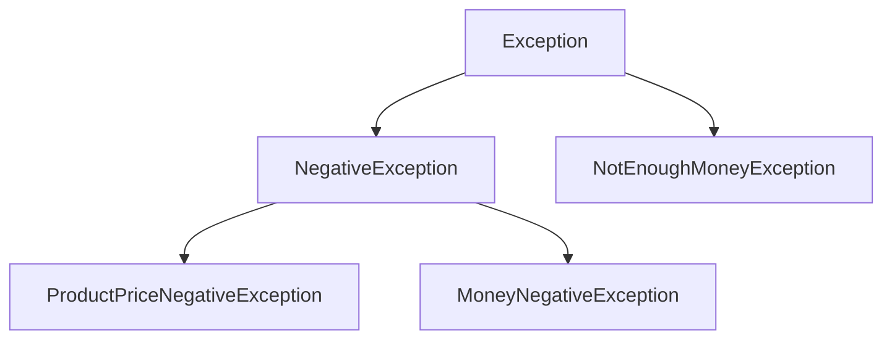

Map·Properties로 컬렉션을 마무리하고, 예외처리(try-catch-finally, 사용자 정의 예외)와 파일 입출력까지 배운 학습 노트다.

<!--more-->

## 컬렉션 마지막 조각과 "실패를 다루는 법" (Situation)

지난번 List·Set까지 배운 컬렉션의 마지막 조각인 Map과 Properties를 배우고, 이어서 예외처리와 파일 입출력까지 진도를 나갔다. 지금까지는 "정상적으로 동작하는 코드"를 짜는 법을 배웠다면, 오늘은 "잘못됐을 때 어떻게 대응할지"를 배운 날이었다.

## 배운 내용 (Task)

목표는 키-값 쌍으로 데이터를 다루는 Map과 설정값 전용 Properties를 확인하고, 컴파일 오류와 런타임 오류의 차이, try-catch-finally로 예외를 처리하는 법, 직접 예외 클래스를 만드는 법, 그리고 파일을 읽고 쓰는 법까지 코드로 익히는 것이었다.

## 정리한 내용 (Action)

### Map — 키-값 한 쌍으로 데이터를 저장하기

List·Set과 달리 Map은 **Key-Value 한 쌍**으로 데이터를 저장한다. Map도 인터페이스라서 `HashMap` 같은 구현체로 객체를 만들어야 한다.

```java
Map<String, String> map2 = new HashMap<>();
map2.put("one", "java");
map2.put("two", "javascript");

map.put(12, "apple");
map.put(12, "banana");  // 같은 key로 다시 put하면 값이 덮어씌워짐
System.out.println(map.get(12));  // banana
```

**key가 중복되면 나중에 넣은 값으로 덮어씌워진다**는 점, 그리고 key는 내부적으로 **Set 방식**(중복 불가)으로 구성되어 있다는 점이 List·Set에서 배운 내용과 자연스럽게 연결됐다.

### Properties — 설정값 전용 Map

```java
Properties prop = new Properties();
prop.setProperty("url", "jdbc:mysql://localhost/menudb");
prop.setProperty("username", "wanted");
```

`.env` 파일의 `DATABASE_URL=...`처럼, **설정 파일을 구성할 때 쓰는 Key-Value 저장소**다. 일반 Map과 다른 점은 **key와 value가 모두 String으로 고정**되어 있다는 것 — 환경설정 값은 어차피 문자열로 다루는 경우가 많기 때문이다.

### 예외 — 컴파일 오류 vs 런타임 오류

| 구분 | 발생 시점 | 예시 |
|------|-----------|------|
| 컴파일 오류 | 코드 작성 중 | 없는 변수 참조, 타입 불일치 |
| 런타임 오류(예외) | 애플리케이션 실행 중 | `NullPointerException`(null 참조), 배열 범위 초과 |

```java
int[] iarr = new int[5];
System.out.println(iarr[6]);  // 배열 범위 초과 - 런타임 에러

String str = null;
str.length();  // NullPointerException - 런타임 에러
```

**예외를 처리하지 않으면 프로그램이 비정상적으로 종료된다**는 걸 직접 코드를 실행해서 확인했다.

### try-catch-finally — 예외가 발생해도 프로그램을 계속 돌리기

```java
try {
    String str = null;
    str.length();
} catch (ArithmeticException e) {
    System.out.println("예외 메세지 = " + e.getMessage());
} catch (NullPointerException e) {
    System.out.println("예외 메세지 = " + e.getMessage());
} finally {
    System.out.println("예외 발생 여부와 관계없이 실행됨...");
}
```

- `try`: 예외가 발생할 가능성이 있는 코드 블럭
- `catch`: 특정 예외를 잡아서 처리하는 블럭 (예외 타입별로 여러 개 작성 가능)
- `finally`: 예외 발생 여부와 **상관없이 항상 실행**되는 블럭

### throw — 예외를 직접 발생시키고, 처리는 호출한 쪽에 맡기기

```java
public static void checkAge(int age) {
    if (age < 0) {
        throw new IllegalArgumentException("나이는 음수일 수 없습니다!");
    }
    System.out.println("전달 받은 " + age + " 는 유효한 나이입니다!");
}
```

여기서 헷갈리기 쉬웠던 부분: **`checkAge()`는 예외를 발생시키기만 할 뿐, 직접 처리하지 않는다.** `throw`는 "이 메소드에서 예외를 처리하는 게 아니라, **나를 호출한 쪽에 예외 처리를 위임한다**"는 의미였다. 실제 처리(`catch`)는 `checkAge()`를 부른 `main()`에서 이루어진다.

```java
try {
    checkAge(-10);
} catch (IllegalArgumentException e) {
    System.out.println(e.getMessage());  // "나이는 음수일 수 없습니다!"
}
```

### 사용자 정의 예외 — 현실의 문제 상황에 맞는 예외 만들기

JDK가 기본으로 제공하는 예외 클래스만으로는 현실에서 발생하는 다양한 문제 상황(상품 가격이 음수, 가진 돈이 부족 등)을 구체적으로 표현하기 어렵다. 그래서 **모든 예외의 부모 클래스인 `Exception`을 상속**받아 직접 예외 클래스를 만들었다.



```java
public class NegativeException extends Exception {
    public NegativeException(String message) {
        super(message);  // 부모(Exception)의 생성자로 메시지를 전달
    }
}

public class ProductPriceNegativeException extends NegativeException {
    public ProductPriceNegativeException(String message) {
        super(message);
    }
}
```

쇼핑 프로그램 예제로 "상품 가격이 음수일 때", "가진 돈이 음수일 때", "가진 돈이 상품 가격보다 부족할 때"를 각각 다른 예외로 구분해서 던지고, 호출부에서 예외 타입별로 다르게 처리했다.

```java
public void checkMoney(int productprice, int money)
        throws ProductPriceNegativeException, MoneyNegativeException, NotEnoughMoneyException {
    if (productprice < 0) throw new ProductPriceNegativeException("상품의 가격은 음수일 수 없습니다!!!");
    if (money < 0) throw new MoneyNegativeException("가진 돈이 음수일 수 없습니다!!!");
    if (money < productprice) throw new NotEnoughMoneyException("가진 돈보다 상품의 가격이 더 비싸요...");
}
```

메소드 선언부의 `throws`는 "이 메소드를 호출하는 쪽은 이런 예외들이 발생할 수 있다는 걸 알고 처리해야 한다"고 미리 알려주는 역할이었다.

### 파일 입출력 — 쓰고, 읽기

```java
// 쓰기
FileWriter writer = new FileWriter("output.txt");
writer.write("Hello, File IO!!");
writer.flush();  // 버퍼(연결통로)에 있는 데이터를 밀어서 디스크에 저장

// 읽기
FileReader reader = new FileReader("output.txt");
int data;
while ((data = reader.read()) != -1) {  // 한 문자씩 읽고, 끝에 도달하면 -1 반환
    System.out.println((char) data);
}
```

File IO 관련 클래스는 **객체 생성 시점부터 예외 처리를 강제**한다는 게 인상적이었다(`IOException`, `FileNotFoundException`을 반드시 `try-catch`로 감싸야 컴파일된다). `flush()`를 호출해야 버퍼에 쌓인 데이터가 실제 디스크 파일에 저장된다는 점도 처음 알았다.

## 결과 (Result)

Map으로 컬렉션 3종(List·Set·Map)을 완성했고, 컴파일 오류와 런타임 오류를 구분하는 법, `try-catch-finally`로 예외 상황에서도 프로그램이 죽지 않게 만드는 법, `throw`로 예외 처리를 호출부에 위임하는 흐름, 그리고 현실 문제에 맞는 사용자 정의 예외를 직접 만들어보는 것까지 이어졌다. 마지막으로 파일 입출력에서 "쓰기는 반드시 flush, 읽기는 -1까지"라는 패턴을 코드로 체감했다.

## 더 학습하면 좋은 개념

- **try-with-resources** — 오늘은 `FileWriter`, `FileReader`를 수동으로 닫지 않았는데, 실제로는 자원을 자동으로 닫아주는 `try-with-resources` 구문을 꼭 써야 한다. 파일이 계속 열려있으면 리소스 누수가 생기기 때문에 다음 단계로 꼭 배워야 할 내용이다.
- **checked vs unchecked 예외** — 오늘 만든 예외는 `Exception`을 상속한 checked 예외라 `throws` 선언이 필수였다. `RuntimeException`을 상속하는 unchecked 예외와의 차이를 알아두면 왜 설계마다 다르게 쓰는지 이해된다.
- **BufferedReader/BufferedWriter** — 오늘 쓴 `FileReader.read()`는 한 글자씩 읽어서 비효율적이다. 버퍼를 이용해 줄 단위로 읽는 방식을 알아두면 실무에 더 가깝다.
- **커스텀 예외의 계층 설계** — 오늘 `NegativeException`을 부모로 두고 `ProductPriceNegativeException`, `MoneyNegativeException`이 상속받은 것처럼, 예외도 상속 계층을 어떻게 설계하느냐에 따라 `catch` 블럭을 얼마나 세밀하게 나눌지 결정된다는 걸 더 파보면 좋다.

## 참고 자료

- [Oracle 공식 문서 - The Map Interface](https://docs.oracle.com/javase/tutorial/collections/interfaces/map.html)
- [Oracle 공식 문서 - Exceptions](https://docs.oracle.com/javase/tutorial/essential/exceptions/index.html)
- [Oracle 공식 문서 - Basic I/O](https://docs.oracle.com/javase/tutorial/essential/io/index.html)
